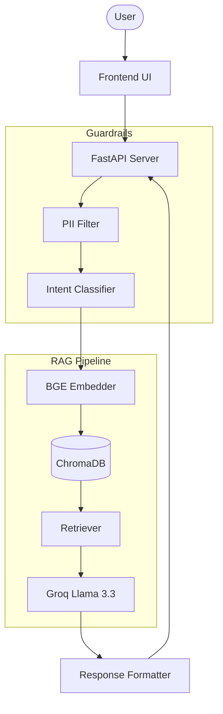

# Mutual Fund FAQ Assistant

A specialized, facts-only mutual fund FAQ assistant for HDFC mutual fund schemes on Groww. It uses a Retrieval-Augmented Generation (RAG) architecture to answer questions strictly from official mutual fund factsheets and data.

## Supported Schemes

1. [HDFC Small Cap Fund](https://groww.in/mutual-funds/hdfc-small-cap-fund-direct-growth)
2. [HDFC Large Cap Fund](https://groww.in/mutual-funds/hdfc-large-cap-fund-direct-growth)
3. [HDFC Mid Cap Fund](https://groww.in/mutual-funds/hdfc-mid-cap-opportunities-fund-direct-growth)
4. [HDFC Gold ETF Fund of Fund](https://groww.in/mutual-funds/hdfc-gold-fund-direct-growth)
5. [HDFC Silver ETF FOF](https://groww.in/mutual-funds/hdfc-silver-etf-fund-of-fund-direct-growth)

## Architecture Overview



## Prerequisites

- Python 3.11+
- Groq API Key (Free tier at [console.groq.com](https://console.groq.com))

## Setup Instructions

1. **Clone and Virtual Environment**
   ```bash
   python3 -m venv venv
   source venv/bin/activate
   pip install -r requirements.txt
   playwright install chromium
   ```

2. **Configuration**
   ```bash
   cp .env.example .env
   ```
   Edit `.env` and insert your `GROQ_API_KEY`.

3. **Ingest Data**
   Run the data pipeline to scrape, chunk, and embed the knowledge base:
   ```bash
   python scripts/ingest.py --full
   ```

4. **Start the API Server**
   ```bash
   uvicorn src.api.server:app --host 0.0.0.0 --port 8000
   ```

5. **Access the App**
   Open your browser and navigate to: `http://localhost:8000/static/index.html`

## Automated Scheduler

This project uses **GitHub Actions** to automatically run the data ingestion pipeline every day at 02:00 AM UTC. This ensures the vector database is kept up to date with the latest Mutual Fund data.

To configure this in your repository:
1. Ensure the `.github/workflows/daily_ingestion.yml` workflow file is present.
2. Add your `GROQ_API_KEY` as a **Repository Secret** in your GitHub settings (Settings > Secrets and variables > Actions).
3. Give the GitHub Actions bot write permissions (Settings > Actions > General > Workflow permissions > "Read and write permissions") so it can commit the updated data back to the repository.

## API Documentation

### 1. `GET /api/health`
Health check endpoint.
**Response**: `{"status": "ok"}`

### 2. `GET /api/schemes`
Lists all supported schemes.
**Response**: 
```json
{
  "schemes": ["HDFC Small Cap Fund", "HDFC Large Cap Fund", "..."]
}
```

### 3. `POST /api/chat`
Main RAG endpoint for queries.
**Request**:
```json
{
  "query": "What is the expense ratio of HDFC Small Cap Fund?"
}
```

**Response (Factual)**:
```json
{
  "answer": "The expense ratio is 0.68%.\n\nSource: [HDFC Small Cap Fund – Groww](...)\nLast updated from sources: 2026-06-30",
  "source_url": "https://groww.in/...",
  "source_title": "HDFC Small Cap Fund - Groww",
  "last_updated": "2026-06-30",
  "refused": false,
  "query_type": "FACTUAL"
}
```

## Known Limitations

- Only trained on 5 specific HDFC mutual fund schemes.
- Does not calculate returns dynamically or compare two funds side-by-side.
- Requires internet access for the Groq API LLM generation.

**Disclaimer**: Facts-only. No investment advice.
# Mutual-Fund-FAQ-assistant
