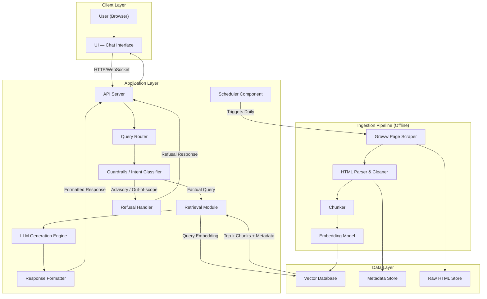
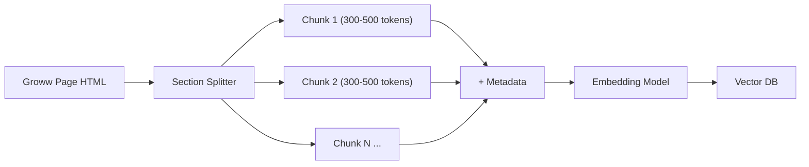
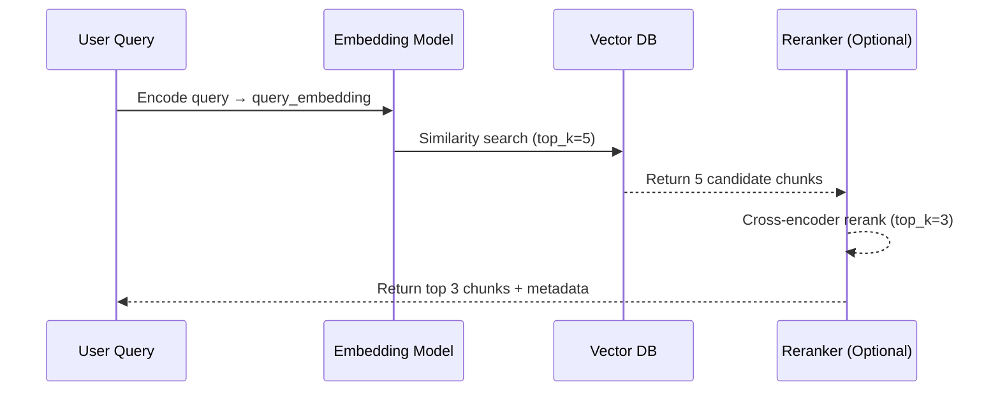
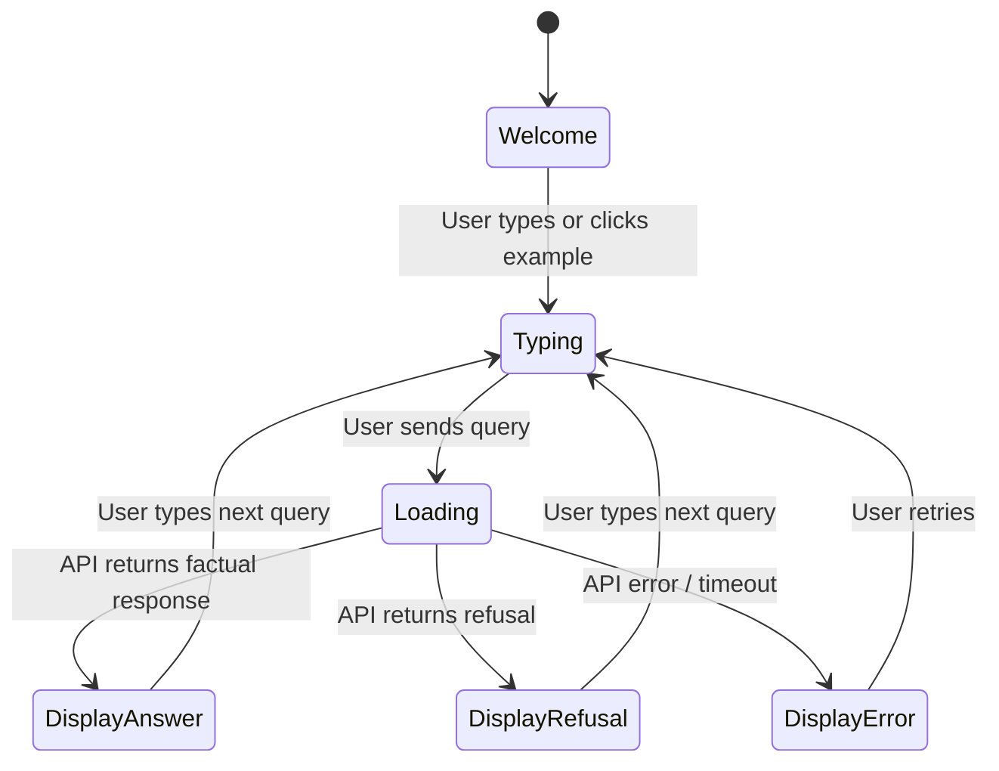
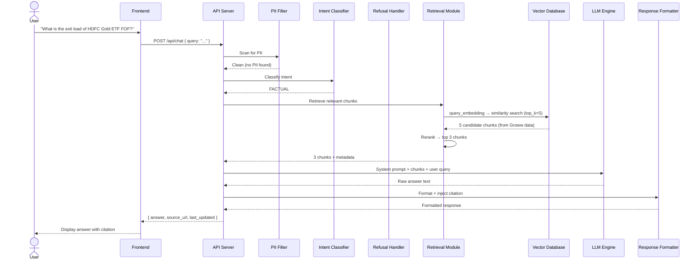

# Architecture: Mutual Fund FAQ Assistant

> Reference: [context.md](./context.md) — project scope, constraints, and success criteria.

---

## 1. System Overview

The Mutual Fund FAQ Assistant is a **Retrieval-Augmented Generation (RAG)** system that answers purely factual questions about 5 selected HDFC mutual fund schemes. It retrieves information from the corresponding **Groww.in scheme pages** (the sole external data source) and generates concise, citation-backed responses — while strictly refusing any advisory or opinion-based queries.

### 1.1 High-Level Architecture Diagram



---

## 2. Project Folder Structure

```
mutual-fund-faq-assistant/
├── .github/
│   └── workflows/
│       └── daily_ingestion.yml # GitHub Actions cron job for daily ingestion
├── docs/
│   ├── context.md              # Project scope & constraints
│   └── Architecture.md         # This document
├── data/
│   ├── raw/                    # Scraped HTML snapshots from Groww
│   ├── processed/              # Cleaned & chunked text
│   └── sources.json            # 5 Groww URL registry with metadata
├── src/
│   ├── ingestion/
│   │   ├── scraper.py          # Fetches HTML from Groww URLs
│   │   ├── parser.py           # HTML → plain text
│   │   ├── chunker.py          # Text → semantic chunks
│   │   └── embedder.py         # Chunks → vector embeddings
│   ├── retrieval/
│   │   ├── vector_store.py     # Vector DB operations (CRUD, search)
│   │   └── reranker.py         # (Optional) cross-encoder reranking
│   ├── generation/
│   │   ├── llm_client.py       # LLM API wrapper
│   │   ├── prompt_templates.py # System & user prompt templates
│   │   └── formatter.py        # Response formatting + citation injection
│   ├── guardrails/
│   │   ├── intent_classifier.py  # Detects advisory vs factual queries
│   │   ├── pii_filter.py         # Blocks PII in input/output
│   │   └── refusal_handler.py    # Generates polite refusal responses
│   ├── api/
│   │   ├── server.py           # API entrypoint (FastAPI / Express)
│   │   └── routes.py           # Endpoint definitions
│   └── config.py               # Environment variables, constants
├── frontend/
│   ├── index.html
│   ├── style.css
│   └── app.js
├── tests/
│   ├── test_guardrails.py
│   ├── test_retrieval.py
│   ├── test_generation.py
│   └── test_e2e.py
├── scripts/
│   └── ingest.py               # One-shot ingestion runner
├── .env.example
├── requirements.txt
└── README.md
```

---

## 3. Core Components — Detailed Design

### 3.1 Data Ingestion Pipeline (Offline / Scheduled)

This pipeline runs **offline or on a schedule** and is responsible for building and updating the knowledge base.

#### 3.1.1 Groww Page Scraper (`scraper.py`)

| Aspect | Details |
|---|---|
| **Input** | `sources.json` — a registry of the 5 Groww scheme URLs |
| **Output** | Raw HTML snapshots stored in `data/raw/` |
| **Sources** | Groww.in scheme pages only |
| **Format** | HTML |

**`sources.json` schema:**
```json
{
  "sources": [
    {
      "id": "hdfc-small-cap",
      "url": "https://groww.in/mutual-funds/hdfc-small-cap-fund-direct-growth",
      "scheme": "HDFC Small Cap Fund",
      "last_fetched": "2026-06-30"
    },
    {
      "id": "hdfc-large-cap",
      "url": "https://groww.in/mutual-funds/hdfc-large-cap-fund-direct-growth",
      "scheme": "HDFC Large Cap Fund",
      "last_fetched": "2026-06-30"
    },
    {
      "id": "hdfc-mid-cap",
      "url": "https://groww.in/mutual-funds/hdfc-mid-cap-fund-direct-growth",
      "scheme": "HDFC Mid Cap Fund",
      "last_fetched": "2026-06-30"
    },
    {
      "id": "hdfc-gold-etf-fof",
      "url": "https://groww.in/mutual-funds/hdfc-gold-etf-fund-of-fund-direct-plan-growth",
      "scheme": "HDFC Gold ETF Fund of Fund",
      "last_fetched": "2026-06-30"
    },
    {
      "id": "hdfc-silver-etf-fof",
      "url": "https://groww.in/mutual-funds/hdfc-silver-etf-fof-direct-growth",
      "scheme": "HDFC Silver ETF FOF",
      "last_fetched": "2026-06-30"
    }
  ]
}
```

#### 3.1.2 HTML Parser & Cleaner (`parser.py`)

| Format | Library / Tool | Strategy |
|---|---|---|
| HTML | `BeautifulSoup4` + `requests` / `Playwright` | Strip navigation, footer, ads; extract main scheme content sections |

**Cleaning rules:**
- Remove site navigation, headers, footers, ads, and promotional banners
- Extract key scheme data sections (expense ratio, exit load, holdings, risk, benchmark, etc.)
- Normalize whitespace and Unicode
- Preserve tabular data (e.g., holdings, sector allocation) as Markdown tables
- Strip any embedded images, SVGs, and non-textual content

#### 3.1.3 Chunker (`chunker.py`)

The chunking strategy is critical for retrieval quality.

| Parameter | Value | Rationale |
|---|---|---|
| **Strategy** | Section-aware recursive splitting | Preserves semantic boundaries (e.g., "Exit Load", "Expense Ratio") |
| **Chunk Size** | 300–500 tokens | Small enough for precise retrieval; large enough for context |
| **Overlap** | 50 tokens | Prevents information loss at chunk boundaries |
| **Metadata per chunk** | `source_url`, `scheme_name`, `section_title`, `last_updated` | Enables filtered retrieval and citation generation |



**Chunk metadata schema:**
```json
{
  "chunk_id": "hdfc-small-cap-chunk-07",
  "text": "The exit load for HDFC Small Cap Fund is 1% if redeemed within 1 year...",
  "scheme_name": "HDFC Small Cap Fund",
  "section_title": "Exit Load",
  "source_url": "https://groww.in/mutual-funds/hdfc-small-cap-fund-direct-growth",
  "last_updated": "2026-06-30",
  "token_count": 342
}
```

#### 3.1.4 Embedding Model (`embedder.py`)

| Option | Model | Dimensions | Notes |
|---|---|---|---|
| **Recommended** | HuggingFace `BAAI/bge-small-en-v1.5` | 384 | Free, runs locally via `sentence-transformers`, no API key needed |
| Alternative A | HuggingFace `BAAI/bge-base-en-v1.5` | 768 | Higher quality, larger model (~440MB) |
| Alternative B | HuggingFace `all-MiniLM-L6-v2` | 384 | Free, lightweight, runs locally |

---

### 3.2 Vector Database (Knowledge Base)

#### 3.2.1 Storage Design

| Aspect | Details |
|---|---|
| **Database** | ChromaDB (local/dev) or Pinecone / Qdrant (production) |
| **Collection** | Single collection: `hdfc_mf_corpus` |
| **Index Type** | HNSW (Hierarchical Navigable Small World) for approximate nearest neighbor search |
| **Distance Metric** | Cosine Similarity |
| **Expected Corpus Size** | ~200–500 chunks (small, fast retrieval) |

#### 3.2.2 Retrieval Strategy



| Parameter | Value | Rationale |
|---|---|---|
| `top_k` (retrieval) | 5 | Cast a wider net initially |
| `top_k` (after reranking) | 3 | Feed only the most relevant chunks to LLM |
| **Metadata filter** | Optional: filter by `scheme_name` if detected in query | Improves precision for scheme-specific queries |
| **Similarity threshold** | 0.65 minimum | Prevents retrieval of irrelevant chunks |

---

### 3.3 Guardrails & Refusal Handler

This is the **first line of defense** — it runs before any retrieval or LLM call.

#### 3.3.1 Intent Classifier (`intent_classifier.py`)

Classifies each incoming query into one of three categories:

| Category | Action | Examples |
|---|---|---|
| `FACTUAL` | Proceed to retrieval → generation | "What is the expense ratio of HDFC Mid Cap Fund?" |
| `ADVISORY` | Route to refusal handler | "Should I invest in HDFC Small Cap?" / "Which fund is better?" |
| `OUT_OF_SCOPE` | Route to refusal handler | "What is the weather today?" / "Tell me about Reliance MF" |

**Implementation options:**
1. **Keyword / regex-based** (v1 — simple): Match patterns like "should I", "better", "recommend", "which one", "vs"
2. **LLM-based classification** (v2 — robust): Use a lightweight LLM call with a classification prompt
3. **Hybrid**: Keyword pre-filter + LLM fallback for ambiguous queries

#### 3.3.2 PII Filter (`pii_filter.py`)

Scans **both input and output** for personally identifiable information.

| PII Type | Detection Method | Action |
|---|---|---|
| PAN Number | Regex: `[A-Z]{5}[0-9]{4}[A-Z]` | Block query, return warning |
| Aadhaar Number | Regex: `\d{4}\s?\d{4}\s?\d{4}` | Block query, return warning |
| Phone Number | Regex: `(\+91)?[6-9]\d{9}` | Strip from input before processing |
| Email Address | Regex: standard email pattern | Strip from input before processing |
| Account Number | Regex: `\d{9,18}` (context-aware) | Block query, return warning |

#### 3.3.3 Refusal Handler (`refusal_handler.py`)

Returns a **static, pre-written** polite refusal. Does **not** invoke the LLM.

**Refusal response template:**
```
I can only provide factual information about mutual fund schemes — such as expense ratios,
exit loads, and minimum investment amounts. I'm not able to offer investment advice or
fund comparisons.

For investment guidance, please visit: https://www.amfiindia.com/investor-corner

Disclaimer: Facts-only. No investment advice.
```

---

### 3.4 LLM Generation Engine

#### 3.4.1 Prompt Design

The prompt is engineered to strictly constrain the LLM's behavior.

**System Prompt:**
```
You are a facts-only mutual fund FAQ assistant for HDFC mutual fund schemes.

RULES — you must follow ALL of these:
1. Answer ONLY using the provided context chunks. Do NOT use your own knowledge.
2. If the context does not contain the answer, respond: "I don't have this information
   in my current sources. Please check the official HDFC AMC website."
3. Keep your answer to a MAXIMUM of 3 sentences.
4. Do NOT provide investment advice, opinions, or recommendations.
5. Do NOT compare funds or calculate returns.
6. For any performance-related query, provide a link to the official factsheet instead.
7. Always end your response with the source citation in this exact format:
   Source: [Document Title](URL)
   Last updated from sources: YYYY-MM-DD
```

**User Prompt Template:**
```
Context:
---
{retrieved_chunks}
---

User Question: {user_query}

Answer (max 3 sentences, with citation):
```

#### 3.4.2 LLM Selection

| Option | Model | Use Case | Cost |
|---|---|---|---|
| **Recommended** | Groq `llama-3.3-70b-versatile` | Ultra-fast inference, strong instruction-following for constrained generation | Free tier available |
| Alternative A | Groq `llama-3.1-8b-instant` | Faster inference, lower quality for simpler queries | Free tier available |
| Alternative B | Groq `mixtral-8x7b-32768` | Good balance of speed and quality, large context window | Free tier available |
| Alternative C | OpenAI `gpt-4o-mini` | High accuracy for nuanced queries (requires OpenAI API key) | Low |

#### 3.4.3 Response Formatter (`formatter.py`)

Takes the raw LLM output and enforces formatting rules:

1. **Truncate** to 3 sentences if LLM exceeds limit
2. **Inject citation** from chunk metadata if LLM fails to include one
3. **Append footer**: `Last updated from sources: <date>`
4. **Sanitize**: Remove any PII, advisory language, or hallucinated URLs

**Example formatted response:**
```
The expense ratio of HDFC Small Cap Fund – Direct Plan is 0.68% (as of June 2026).
This is the Total Expense Ratio (TER) charged annually on the fund's assets.

Source: [HDFC Small Cap Fund – Groww](https://groww.in/mutual-funds/hdfc-small-cap-fund-direct-growth)
Last updated from sources: 2026-06-30
```

---

### 3.5 API Server

#### 3.5.1 Endpoints

| Method | Endpoint | Description | Request Body | Response |
|---|---|---|---|---|
| `POST` | `/api/chat` | Submit a user query | `{ "query": "..." }` | `{ "answer": "...", "source_url": "...", "refused": false }` |
| `GET` | `/api/health` | Health check | — | `{ "status": "ok" }` |
| `GET` | `/api/schemes` | List available schemes | — | `[ { "name": "...", "url": "..." } ]` |

#### 3.5.2 Request/Response Schema

**Chat Request:**
```json
{
  "query": "What is the minimum SIP amount for HDFC Large Cap Fund?",
  "session_id": "optional-session-id"
}
```

**Chat Response (Factual):**
```json
{
  "answer": "The minimum SIP amount for HDFC Large Cap Fund – Direct Plan is ₹500 per month. This can be started through the HDFC AMC website or through registered distributors.",
  "source_url": "https://groww.in/mutual-funds/hdfc-large-cap-fund-direct-growth",
  "source_title": "HDFC Large Cap Fund – Groww",
  "last_updated": "2026-06-30",
  "refused": false,
  "query_type": "FACTUAL"
}
```

**Chat Response (Refused):**
```json
{
  "answer": "I can only provide factual information about mutual fund schemes...",
  "source_url": "https://www.amfiindia.com/investor-corner",
  "refused": true,
  "query_type": "ADVISORY"
}
```

---

### 3.6 User Interface (Frontend)

A minimal, single-page chat UI.

#### 3.6.1 Components

| Component | Description |
|---|---|
| **Header** | App title + persistent disclaimer badge: `"Facts-only. No investment advice."` |
| **Welcome Card** | Greeting message explaining the assistant's purpose |
| **Example Questions** | 3 clickable chips (e.g., "Expense ratio of HDFC Mid Cap Fund?") |
| **Chat Area** | Scrollable message list with user/bot message bubbles |
| **Input Bar** | Text input + send button |
| **Citation Footer** | Rendered below each bot message with clickable source link |

#### 3.6.2 UI State Machine



### 3.7 Scheduler Component

The **Scheduler Component** is responsible for automating the knowledge base updates.

| Aspect | Details |
|---|---|
| **Trigger** | Time-based (daily, e.g., `0 2 * * *` for 02:00 AM) |
| **Action** | Invokes the Data Ingestion Pipeline (`scripts/ingest.py --full`) and commits updates |
| **Implementation** | GitHub Actions Workflow (`.github/workflows/daily_ingestion.yml`) |

---

## 4. Data Flow — End-to-End Sequence



---

## 5. Schemes Covered

The corpus is scoped to 5 HDFC mutual fund schemes with deliberate category diversity:

| # | Scheme Name | Category | Groww URL |
|---|---|---|---|
| 1 | HDFC Gold ETF Fund of Fund – Direct Plan Growth | Commodity / Gold | [Link](https://groww.in/mutual-funds/hdfc-gold-etf-fund-of-fund-direct-plan-growth) |
| 2 | HDFC Large Cap Fund – Direct Growth | Equity / Large Cap | [Link](https://groww.in/mutual-funds/hdfc-large-cap-fund-direct-growth) |
| 3 | HDFC Small Cap Fund – Direct Growth | Equity / Small Cap | [Link](https://groww.in/mutual-funds/hdfc-small-cap-fund-direct-growth) |
| 4 | HDFC Silver ETF FOF – Direct Growth | Commodity / Silver | [Link](https://groww.in/mutual-funds/hdfc-silver-etf-fof-direct-growth) |
| 5 | HDFC Mid Cap Fund – Direct Growth | Equity / Mid Cap | [Link](https://groww.in/mutual-funds/hdfc-mid-cap-fund-direct-growth) |

---

## 6. Security & Privacy

### 6.1 Data Handling

| Principle | Implementation |
|---|---|
| **No PII storage** | PII filter strips/blocks PAN, Aadhaar, phone, email, account numbers from all inputs |
| **No conversation logging** | User queries are processed in-memory only; no chat history persisted |
| **Groww as sole source** | All corpus data scraped exclusively from the 5 Groww.in scheme pages |
| **No other external data** | No PDFs, no AMC website docs, no AMFI/SEBI documents, no blogs or forums |

### 6.2 API Security

| Measure | Details |
|---|---|
| **Rate Limiting** | Max 30 requests/minute per IP |
| **Input Sanitization** | Strip HTML, script tags, and SQL injection patterns |
| **CORS** | Restrict to frontend origin only |
| **Environment Variables** | API keys stored in `.env`, never committed to version control |

---

## 7. Error Handling

| Scenario | Behavior |
|---|---|
| **LLM API timeout / failure** | Return: "I'm temporarily unable to process your question. Please try again shortly." |
| **No relevant chunks found** (similarity < threshold) | Return: "I don't have information about this in my current sources. Please visit the official HDFC AMC website." |
| **PII detected in query** | Block processing. Return: "For your security, please do not share personal information like PAN, Aadhaar, or account numbers." |
| **Malformed query** (empty / too short) | Return: "Could you please rephrase your question? Try asking about a specific scheme's expense ratio, exit load, or SIP amount." |
| **Vector DB connection failure** | Return generic error; log incident for ops |

---

## 8. Technology Stack — Recommended

| Layer | Technology | Justification |
|---|---|---|
| **Frontend** | Vanilla HTML/CSS/JS | Minimal UI requirement; no framework overhead |
| **Backend / API** | Python + FastAPI | Lightweight, async-native, great for ML/AI pipelines |
| **Orchestration** | LangChain | Composable RAG pipeline with built-in chunking, retrieval, and LLM chaining |
| **Vector Database** | ChromaDB | Free, local-first, easy setup for small corpora |
| **Embedding Model** | HuggingFace `BAAI/bge-small-en-v1.5` | Free, runs locally via `sentence-transformers`, no API key needed |
| **LLM** | Groq `llama-3.3-70b-versatile` | Ultra-fast inference, strong instruction-following, free tier available |
| **HTML Scraping** | `BeautifulSoup4` + `requests` / `Playwright` | Scrapes and parses Groww scheme pages |

---

## 9. Future Enhancements (Out of Current Scope)

| Enhancement | Description |
|---|---|
| **More schemes** | Add more HDFC scheme Groww pages to the corpus |
| **Multi-AMC support** | Expand corpus to cover schemes from SBI, ICICI, etc. on Groww |
| **Additional sources** | Supplement Groww data with official AMC PDFs (factsheets, KIM, SID) |
| **Conversation memory** | Maintain context across multi-turn conversations |
| **Analytics dashboard** | Track query types, refusal rates, and retrieval accuracy |
| **Multilingual support** | Hindi and regional language query handling |
| **Voice interface** | Speech-to-text input for accessibility |
