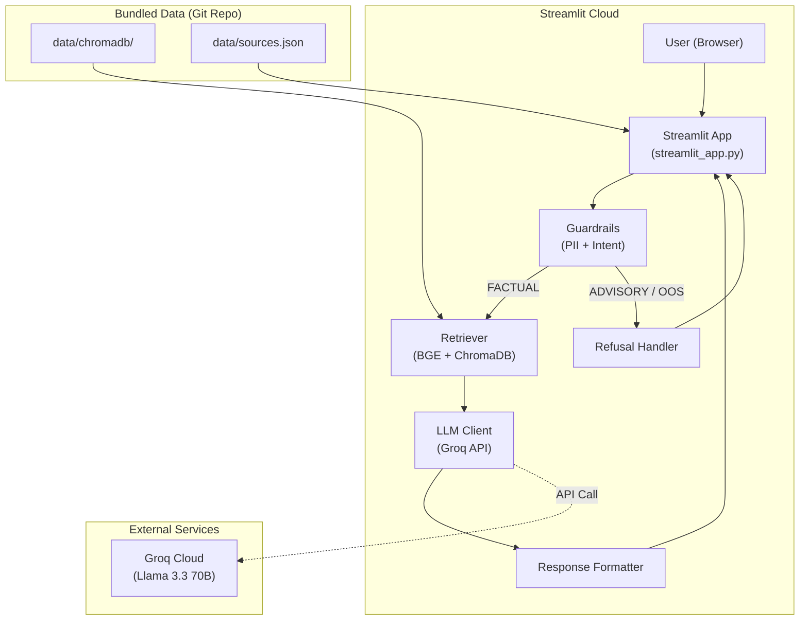
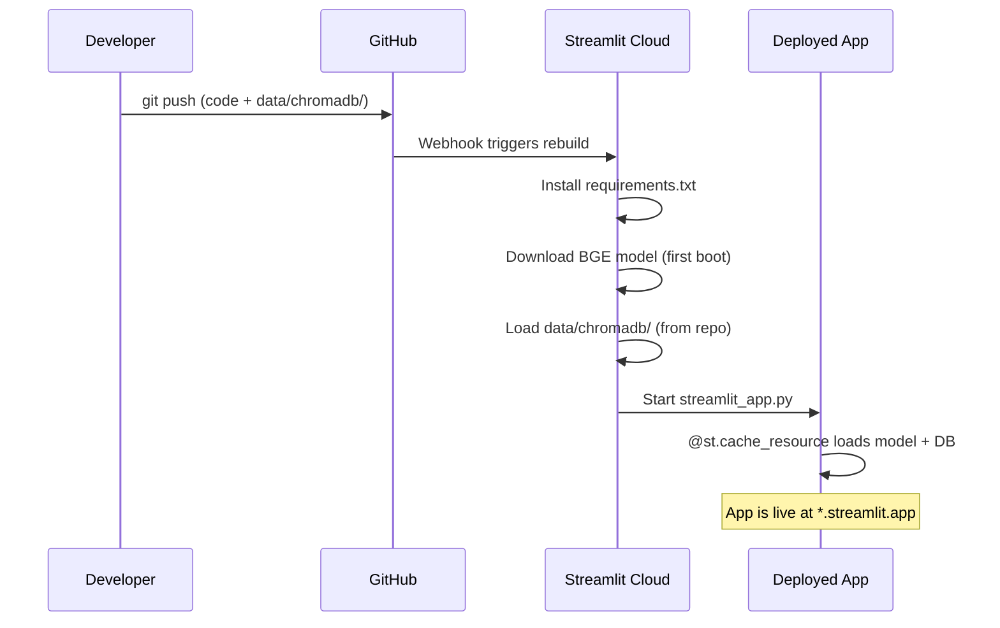
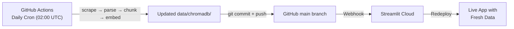

# Deployment Plan: Streamlit Community Cloud

> **Project**: Mutual Fund FAQ Assistant  
> **Target Platform**: [Streamlit Community Cloud](https://streamlit.io/cloud)  
> **Created**: 2026-07-20  
> **Reference**: [Architecture.md](./Architecture.md) · [implementation_plan.md](./implementation_plan.md)

---

## Table of Contents

1. [Deployment Overview](#1-deployment-overview)
2. [Architecture Changes for Streamlit](#2-architecture-changes-for-streamlit)
3. [Phase 1 — Create the Streamlit App](#3-phase-1--create-the-streamlit-app)
4. [Phase 2 — Dependency & Configuration Updates](#4-phase-2--dependency--configuration-updates)
5. [Phase 3 — Deploy to Streamlit Community Cloud](#5-phase-3--deploy-to-streamlit-community-cloud)
6. [Phase 4 — CI/CD & Daily Ingestion Adaptation](#6-phase-4--cicd--daily-ingestion-adaptation)
7. [Known Limitations & Constraints](#7-known-limitations--constraints)
8. [Post-Deployment Checklist](#8-post-deployment-checklist)

---

## 1. Deployment Overview

### Current Architecture

The app currently uses a **FastAPI backend + Vanilla HTML/CSS/JS frontend** served as static files:

```
User → index.html (static) → fetch('/api/chat') → FastAPI → RAG Pipeline → Response
```

### Target Architecture (Streamlit)

Streamlit replaces **both** the FastAPI server and the HTML/CSS/JS frontend with a single `streamlit_app.py` file:

```
User → Streamlit Cloud → streamlit_app.py → RAG Pipeline (in-process) → Response
```



### Why Streamlit?

| Factor | FastAPI + Static Files | Streamlit Community Cloud |
|--------|----------------------|--------------------------|
| **Hosting cost** | Requires a VPS/PaaS (Render, Railway, etc.) | **Free** (Community Cloud) |
| **Deployment** | Manual Docker/build setup | **Git push → auto-deploy** |
| **Frontend code** | 3 files (HTML/CSS/JS) to maintain | **Zero frontend code** — Python only |
| **SSL/Domain** | Manual configuration | **Auto HTTPS** + `*.streamlit.app` subdomain |
| **Scaling** | Self-managed | Managed by Streamlit |
| **State management** | Stateless REST API | Session state built-in |

---

## 2. Architecture Changes for Streamlit

### What Changes

| Component | Current | After Streamlit | Notes |
|-----------|---------|-----------------|-------|
| **Frontend** | `frontend/index.html`, `style.css`, `app.js` | **Removed** — replaced by Streamlit widgets | No HTML/CSS/JS needed |
| **API Server** | `src/api/server.py`, `routes.py`, `limiter.py` | **Bypassed** — Streamlit calls pipeline directly | FastAPI stays in repo for local/API use |
| **Entry Point** | `uvicorn src.api.server:app` | `streamlit run streamlit_app.py` | New file at project root |
| **Rate Limiting** | `slowapi` middleware | Streamlit Cloud handles basic DDoS; app-level throttle optional | Simplified |
| **CORS** | FastAPI CORS middleware | **Not needed** — no cross-origin requests | Streamlit serves everything |
| **Static Files** | Mounted at `/static` | **Not needed** — Streamlit renders UI | — |

### What Does NOT Change

| Component | Status |
|-----------|--------|
| `src/guardrails/*` (PII filter, intent classifier, refusal handler) | ✅ Unchanged |
| `src/retrieval/*` (vector store, retriever, reranker) | ✅ Unchanged |
| `src/generation/*` (LLM client, prompt templates, formatter) | ✅ Unchanged |
| `src/ingestion/*` (scraper, parser, chunker, embedder) | ✅ Unchanged |
| `src/config.py` | ✅ Unchanged (reads env vars the same way) |
| `data/chromadb/` (persisted vector store) | ✅ Bundled in repo, loaded at runtime |
| `data/sources.json` | ✅ Unchanged |
| `scripts/ingest.py` | ✅ Unchanged (runs offline or via GitHub Actions) |
| `tests/*` | ✅ Unchanged |

> **Key insight**: The entire RAG pipeline (`guardrails → retrieval → generation`) is already modular Python. Streamlit just calls the same functions that `routes.py` calls, minus the HTTP layer.

---

## 3. Phase 1 — Create the Streamlit App

### 3.1 New File: `streamlit_app.py`

Create at the **project root** (required by Streamlit Cloud):

```
mutual-fund-faq-assistant/
├── streamlit_app.py          ← NEW (Streamlit entry point)
├── src/
├── data/
├── ...
```

### 3.2 App Structure

```python
import streamlit as st
from src.config import SOURCES_FILE, validate_config
from src.guardrails.pii_filter import scan_input
from src.guardrails.intent_classifier import classify_intent
from src.guardrails.refusal_handler import get_refusal_response
from src.retrieval.retriever import retrieve
from src.generation.prompt_templates import SYSTEM_PROMPT, USER_PROMPT_TEMPLATE, format_context
from src.generation.llm_client import LLMClient
from src.generation.formatter import format_response
import json
import re

# ─── Page Configuration ─────────────────────────────────────────
st.set_page_config(
    page_title="HDFC Fund FAQ Assistant",
    page_icon="📊",
    layout="centered",
    initial_sidebar_state="collapsed"
)

# ─── Custom CSS ──────────────────────────────────────────────────
# Inject custom styling for the chat interface
st.markdown("""<style>...</style>""", unsafe_allow_html=True)

# ─── Session State Initialization ────────────────────────────────
if "messages" not in st.session_state:
    st.session_state.messages = []

# ─── Header ──────────────────────────────────────────────────────
st.title("📊 HDFC Fund FAQ Assistant")
st.caption("Facts-only · No investment advice · Powered by Groww data")

# ─── Sidebar: Supported Schemes ─────────────────────────────────
with st.sidebar:
    st.header("Supported Schemes")
    # Load from sources.json and display

# ─── Chat History Display ────────────────────────────────────────
for message in st.session_state.messages:
    with st.chat_message(message["role"]):
        st.markdown(message["content"])

# ─── Example Question Chips (on first load) ─────────────────────
if not st.session_state.messages:
    st.info("👋 Hello! Ask me about HDFC mutual fund schemes.")
    cols = st.columns(3)
    # Display clickable example buttons

# ─── Chat Input ──────────────────────────────────────────────────
if prompt := st.chat_input("Ask about HDFC mutual funds..."):
    # 1. Display user message
    # 2. Sanitize input
    # 3. PII filter
    # 4. Intent classification
    # 5. Retrieval (if FACTUAL)
    # 6. LLM generation
    # 7. Format response
    # 8. Display bot response with citation
```

### 3.3 Pipeline Integration (Key Logic)

The core logic inside the chat input handler mirrors `routes.py` but without HTTP:

```python
def process_query(query: str) -> dict:
    """
    Run the full RAG pipeline. Returns a dict with:
    answer, source_url, source_title, last_updated, refused, query_type
    """
    # Step 1: Sanitize
    safe_query = sanitize_input(query)
    if not safe_query:
        refusal = get_refusal_response("MALFORMED")
        return {"answer": refusal["answer"], "refused": True, "query_type": "MALFORMED"}

    # Step 2: PII check
    pii_res = scan_input(safe_query)
    if pii_res.blocked:
        refusal = get_refusal_response("PII", pii_res.warning_message)
        return {"answer": refusal["answer"], "refused": True, "query_type": "PII"}
    safe_query = pii_res.cleaned_text

    # Step 3: Intent classification
    intent_res = classify_intent(safe_query)
    if intent_res.intent in ["ADVISORY", "OUT_OF_SCOPE", "MALFORMED"]:
        refusal = get_refusal_response(intent_res.intent)
        return {"answer": refusal["answer"], "refused": True, "query_type": intent_res.intent}

    # Step 4: Retrieve chunks
    chunks = retrieve(query=safe_query, scheme_name=intent_res.scheme_name)
    if not chunks:
        return {
            "answer": "I don't have this information in my knowledge base.",
            "refused": False, "query_type": intent_res.intent
        }

    # Step 5: Generate LLM response
    chunks_dicts = [chunk.to_dict() for chunk in chunks]
    context_str = format_context(chunks_dicts)
    user_prompt = USER_PROMPT_TEMPLATE.format(
        retrieved_chunks_with_metadata=context_str,
        user_query=safe_query
    )

    llm_client = LLMClient()
    llm_output = llm_client.generate_response(
        system_prompt=SYSTEM_PROMPT,
        user_prompt=user_prompt
    )

    # Step 6: Format
    final_result = format_response(llm_output, chunks_dicts)

    return {
        "answer": final_result["answer"],
        "source_url": chunks[0].source_url,
        "source_title": f"{chunks[0].scheme_name} - Groww",
        "last_updated": chunks[0].last_updated,
        "refused": False,
        "query_type": intent_res.intent
    }
```

### 3.4 Caching Strategy

Use Streamlit's caching decorators to avoid reloading heavy resources on every interaction:

```python
@st.cache_resource
def load_embedding_model():
    """Load BGE embedding model once per app instance."""
    from sentence_transformers import SentenceTransformer
    return SentenceTransformer("BAAI/bge-small-en-v1.5")

@st.cache_resource
def load_vector_store():
    """Load ChromaDB client and collection once per app instance."""
    from src.retrieval.vector_store import get_collection
    return get_collection()

@st.cache_data
def load_schemes():
    """Load scheme list from sources.json."""
    with open(SOURCES_FILE, "r") as f:
        data = json.load(f)
    return [s["scheme"] for s in data.get("sources", [])]
```

> **Important**: `@st.cache_resource` persists across reruns (good for models/DB connections). `@st.cache_data` caches serializable data.

### 3.5 Acceptance Criteria

- [ ] `streamlit run streamlit_app.py` launches locally without errors
- [ ] Chat interface displays welcome message and example question chips
- [ ] Submitting a factual query returns a response with citation
- [ ] Advisory/out-of-scope queries display refusal messages
- [ ] PII in queries triggers appropriate warning
- [ ] Chat history persists across interactions within a session
- [ ] Sidebar lists all 5 supported HDFC schemes
- [ ] Embedding model and ChromaDB load only once (cached)

---

## 4. Phase 2 — Dependency & Configuration Updates

### 4.1 Add `streamlit` to `requirements.txt`

```diff
+ # ─── Streamlit UI ────────────────────────────────────────────────────────────
+ streamlit
```

### 4.2 Create `.streamlit/config.toml`

Streamlit-specific configuration for the deployed app:

```toml
[theme]
primaryColor = "#1E40AF"        # Blue accent (matches HDFC brand)
backgroundColor = "#0F172A"     # Dark background
secondaryBackgroundColor = "#1E293B"  # Slightly lighter panels
textColor = "#E2E8F0"           # Light text
font = "sans serif"

[server]
headless = true
port = 8501
enableCORS = false
enableXsrfProtection = true

[browser]
gatherUsageStats = false
```

### 4.3 Handle Streamlit Cloud Secrets

Streamlit Cloud uses a **Secrets management** system instead of `.env` files.

Update `src/config.py` to support **both** `.env` (local) and Streamlit secrets (cloud):

```python
# ─── Environment Variables ───────────────────────────────────────
import os
from dotenv import load_dotenv

load_dotenv(PROJECT_ROOT / ".env")

# Support Streamlit Cloud secrets (takes priority over .env)
try:
    import streamlit as st
    GROQ_API_KEY = st.secrets.get("GROQ_API_KEY", os.getenv("GROQ_API_KEY", ""))
except (ImportError, AttributeError, FileNotFoundError):
    GROQ_API_KEY = os.getenv("GROQ_API_KEY", "")
```

> **On Streamlit Cloud**: Secrets are set via the app dashboard (Settings → Secrets) in TOML format:
> ```toml
> GROQ_API_KEY = "gsk_..."
> ```

### 4.4 Create `packages.txt` (System Dependencies)

Streamlit Cloud uses Debian-based containers. If Playwright or other system-level deps are needed:

```
# packages.txt — System-level dependencies for Streamlit Cloud
# NOTE: Playwright (headless browser for scraping) is NOT needed at runtime
# because scraping runs offline via GitHub Actions, not in the deployed app.
# The deployed app only needs ChromaDB (file-based) and sentence-transformers.
```

> **Rationale**: The Streamlit app does NOT run the scraping pipeline. It only reads from the pre-built `data/chromadb/` vector store. So `playwright` and its system dependencies are **not needed at runtime**.

### 4.5 Slim Down Runtime Dependencies

Create a separate `requirements-streamlit.txt` for cloud deployment (optional but recommended to reduce cold-start time):

```
# ─── Streamlit UI ────────────────────────────────────────────────
streamlit

# ─── Config & Validation ─────────────────────────────────────────
pydantic
python-dotenv

# ─── LLM (Groq API) ──────────────────────────────────────────────
groq

# ─── Embeddings (BGE model, local inference) ──────────────────────
sentence-transformers
torch

# ─── Vector Database ──────────────────────────────────────────────
chromadb

# ─── Token Counting ──────────────────────────────────────────────
tiktoken
```

**Excluded from runtime** (only needed for ingestion/testing):
- `fastapi`, `uvicorn`, `slowapi` — API server not used
- `beautifulsoup4`, `playwright`, `lxml` — scraping runs offline
- `langchain`, `langchain-community` — not used in current pipeline
- `pytest`, `httpx` — testing only
- `rich` — CLI formatting for scripts

> **Decision**: You can either use the full `requirements.txt` (simpler, slower cold-start) or create this slim file and point Streamlit Cloud to it.

### 4.6 File Structure After Changes

```
mutual-fund-faq-assistant/
├── .streamlit/
│   └── config.toml                ← NEW (theme + server config)
├── streamlit_app.py               ← NEW (Streamlit entry point)
├── requirements.txt               ← MODIFIED (add streamlit)
├── requirements-streamlit.txt     ← NEW (optional slim deps)
├── packages.txt                   ← NEW (system deps, likely empty)
├── src/                           ← UNCHANGED
├── data/                          ← UNCHANGED (chromadb bundled in repo)
├── frontend/                      ← KEPT (for FastAPI fallback)
├── scripts/                       ← UNCHANGED
├── tests/                         ← UNCHANGED
├── .github/workflows/             ← MODIFIED (Phase 4)
└── ...
```

---

## 5. Phase 3 — Deploy to Streamlit Community Cloud

### 5.1 Prerequisites

| Requirement | Status | Action |
|-------------|--------|--------|
| GitHub repository (public or private) | ✅ Exists | `snehichanchal/Mutual-Fund-FAQ-assistant` |
| Streamlit Community Cloud account | ❓ | Sign up at [streamlit.io/cloud](https://streamlit.io/cloud) with GitHub |
| `streamlit_app.py` at repo root | 🔧 | Create in Phase 1 |
| `requirements.txt` with `streamlit` | 🔧 | Update in Phase 2 |
| GROQ_API_KEY | ✅ Exists | Add to Streamlit Secrets |

### 5.2 Step-by-Step Deployment

#### Step 1: Push Changes to GitHub

```bash
git add streamlit_app.py .streamlit/ requirements.txt packages.txt
git commit -m "feat: Add Streamlit app for cloud deployment"
git push origin main
```

#### Step 2: Connect to Streamlit Community Cloud

1. Go to [share.streamlit.io](https://share.streamlit.io)
2. Click **"New app"**
3. Select your repository: `snehichanchal/Mutual-Fund-FAQ-assistant`
4. Set:
   - **Branch**: `main`
   - **Main file path**: `streamlit_app.py`
5. Click **"Advanced settings"** → add secrets:
   ```toml
   GROQ_API_KEY = "gsk_WDjWIzR..."
   ```
6. Click **"Deploy!"**

#### Step 3: Verify Deployment

- App URL will be: `https://<app-name>.streamlit.app`
- Check that:
  - App loads without errors
  - ChromaDB vector store loads from `data/chromadb/`
  - Embedding model downloads and caches on first load
  - Queries return correct responses

### 5.3 Deployment Flow Diagram



### 5.4 Cold Start & Performance

| Resource | First Load | Subsequent Loads |
|----------|-----------|-----------------|
| **BGE embedding model** (~133 MB) | ~15–30s download from HuggingFace | Cached by `@st.cache_resource` |
| **ChromaDB** (~888 KB) | ~1s load from repo files | Cached by `@st.cache_resource` |
| **Groq API call** | ~1–3s per query | No caching (real-time) |
| **Total first query** | ~20–35s (first boot) | ~2–5s (warm) |

> **Note**: Streamlit Cloud apps go to sleep after ~15 minutes of inactivity. The next visit triggers a cold start (~30–60s).

---

## 6. Phase 4 — CI/CD & Daily Ingestion Adaptation

### 6.1 Problem

The current GitHub Actions workflow (`daily_ingestion.yml`) runs the ingestion pipeline and commits updated `data/` to the repo. When the repo is connected to Streamlit Cloud, **any push to `main` triggers a redeploy**. This is actually **beneficial** — the daily ingestion automatically refreshes the deployed app's knowledge base.

### 6.2 Updated Workflow

The existing workflow **works as-is** with Streamlit Cloud:

```
GitHub Actions (02:00 AM UTC)
  → Run ingest.py --full
  → Commit updated data/chromadb/ to main
  → Push to GitHub
  → Streamlit Cloud detects push
  → Redeploys with fresh vector store
```

No changes needed to `.github/workflows/daily_ingestion.yml`.

### 6.3 Ensuring ChromaDB Data is Committed

Verify that `.gitignore` does **NOT** exclude `data/chromadb/`:

```bash
# Current .gitignore — data/chromadb/ is NOT listed ✅
```

If it were listed, you'd need to remove the exclusion:

```diff
# .gitignore
- data/chromadb/
```

### 6.4 CI/CD Flow Diagram



---

## 7. Known Limitations & Constraints

### 7.1 Streamlit Community Cloud Limits

| Constraint | Limit | Impact |
|-----------|-------|--------|
| **RAM** | 1 GB | BGE-small (~133 MB) + ChromaDB (~50 MB) + Python overhead fits within limit. Monitor if corpus grows. |
| **CPU** | Shared | Embedding model runs on CPU — fine for query-time inference (single query at a time). |
| **Disk** | Limited | ChromaDB data (~888 KB) is well within limits. |
| **Sleep timeout** | ~15 min inactivity | App sleeps; cold start on next visit (~30–60s). |
| **Concurrent users** | ~1–3 | Community Cloud is single-threaded. Multiple users may experience queuing. |
| **Repo size** | < 1 GB recommended | Current repo (with data) is ~4 MB — no issues. |

### 7.2 Streamlit vs FastAPI Trade-offs

| Aspect | Impact | Mitigation |
|--------|--------|------------|
| **No REST API** | External clients can't call `/api/chat` | Keep FastAPI in repo for API-first deployments |
| **Single-threaded** | One query processes at a time | Acceptable for a demo/low-traffic app |
| **No WebSocket** | Can't do streaming responses | Use `st.spinner()` for loading indication |
| **UI customization** | Limited compared to raw HTML/CSS | Use `st.markdown(unsafe_allow_html=True)` for custom styling |
| **No background tasks** | Can't run ingestion in the deployed app | Ingestion runs via GitHub Actions (already solved) |

### 7.3 Torch/Sentence-Transformers Size

`torch` is a large dependency (~2 GB). This may cause:
- **Slow first deployment** (pip install takes 5–10 minutes)
- **High memory usage** on Community Cloud

**Mitigation options** (if RAM becomes an issue):
1. Use `torch` CPU-only: Add `--extra-index-url https://download.pytorch.org/whl/cpu` to reduce size
2. Pre-compute embeddings and store only query-time embedding logic
3. Switch to a lighter embedding library (e.g., `onnxruntime` with ONNX-exported BGE model)

---

## 8. Post-Deployment Checklist

### 8.1 Functional Verification

| # | Test | Expected Result | Status |
|:-:|------|-----------------|:------:|
| 1 | App loads at `*.streamlit.app` | Welcome message + example chips displayed | ☐ |
| 2 | "What is the expense ratio of HDFC Small Cap Fund?" | Factual answer with citation and source link | ☐ |
| 3 | "Should I invest in HDFC Mid Cap Fund?" | Polite refusal (advisory) | ☐ |
| 4 | "What is the weather today?" | Out-of-scope refusal | ☐ |
| 5 | Input with PAN number | PII warning, query blocked | ☐ |
| 6 | Multiple queries in sequence | Chat history persists in session | ☐ |
| 7 | Sidebar shows 5 schemes | All HDFC schemes listed | ☐ |
| 8 | App sleeps → revisit | Cold start completes, app is functional | ☐ |

### 8.2 Performance Verification

| # | Metric | Target | Status |
|:-:|--------|--------|:------:|
| 1 | Cold start time | < 60 seconds | ☐ |
| 2 | Warm query response | < 5 seconds | ☐ |
| 3 | Memory usage (steady state) | < 800 MB | ☐ |
| 4 | Daily ingestion → auto-redeploy | Data refreshed within 1 hour of cron | ☐ |

### 8.3 Security Verification

| # | Check | Status |
|:-:|-------|:------:|
| 1 | GROQ_API_KEY is in Streamlit Secrets (not in code) | ☐ |
| 2 | `.env` is in `.gitignore` (not committed) | ☐ |
| 3 | PII filter works on deployed app | ☐ |
| 4 | No API keys visible in app UI or logs | ☐ |

---

## Summary of Files to Create/Modify

| Action | File | Description |
|:------:|------|-------------|
| **NEW** | `streamlit_app.py` | Main Streamlit entry point (project root) |
| **NEW** | `.streamlit/config.toml` | Theme and server configuration |
| **NEW** | `packages.txt` | System dependencies (likely empty) |
| **NEW** | `requirements-streamlit.txt` | Slim runtime dependencies (optional) |
| **MODIFY** | `requirements.txt` | Add `streamlit` |
| **MODIFY** | `src/config.py` | Add Streamlit secrets fallback for `GROQ_API_KEY` |
| **KEEP** | `src/api/*`, `frontend/*` | Retained for local/API-first usage |
| **KEEP** | `.github/workflows/daily_ingestion.yml` | Works as-is with Streamlit Cloud |
