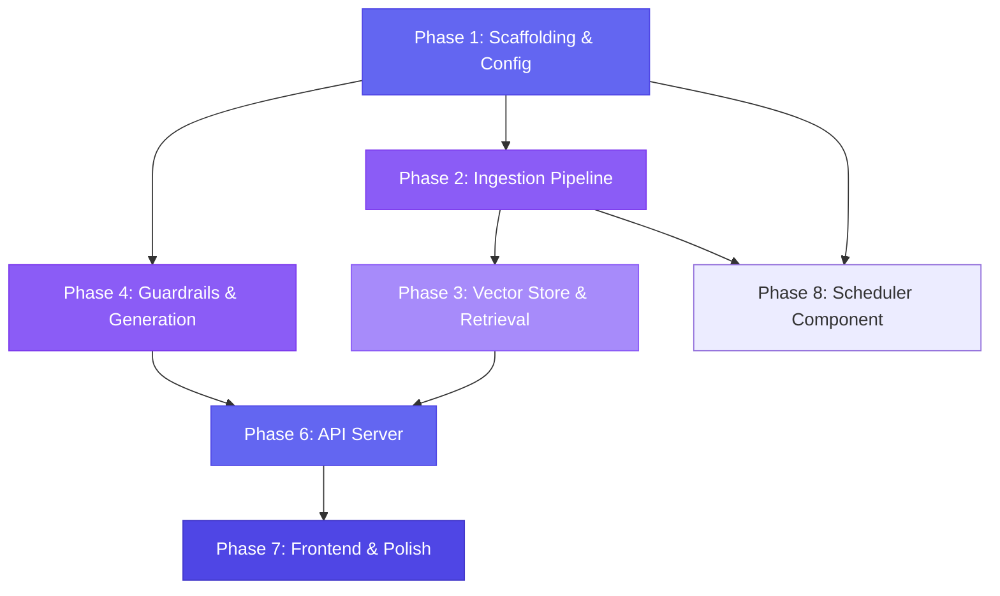

# Implementation Plan: Mutual Fund FAQ Assistant

> **Reference**: [Architecture.md](./Architecture.md) · [context.md](./context.md)  
> **Created**: 2026-07-01  
> **Status**: Ready for execution

---

## Table of Contents

1. [Plan Overview](#1-plan-overview)
2. [Phase 1 — Project Scaffolding & Configuration](#2-phase-1--project-scaffolding--configuration)
3. [Phase 2 — Data Ingestion Pipeline](#3-phase-2--data-ingestion-pipeline)
4. [Phase 3 — Vector Store Setup](#4-phase-3--vector-store-setup)
5. [Phase 4 — Retrieval Logic](#5-phase-4--retrieval-logic)
6. [Phase 5 — Guardrails & LLM Generation](#6-phase-5--guardrails--llm-generation)
7. [Phase 6 — API Server](#7-phase-6--api-server)
8. [Phase 7 — Frontend UI & Documentation](#8-phase-7--frontend-ui--documentation)
9. [Phase 8 — Scheduler Component](#9-phase-8--scheduler-component)
10. [Phase Dependency Graph](#10-phase-dependency-graph)
11. [Technology Stack Reference](#11-technology-stack-reference)
12. [Risk & Assumptions](#12-risk--assumptions)
13. [End-to-End Smoke Test](#13-end-to-end-smoke-test)

---

## 1. Plan Overview

This document breaks the full RAG-based Mutual Fund FAQ Assistant into **7 sequential phases**, each producing a **testable, self-contained increment**. Dependencies flow strictly downward — no phase depends on a later one.

### Phase Summary

| Phase | Name | Key Deliverables | Est. Effort |
|:-----:|------|-----------------|:-----------:|
| **1** | Project Scaffolding & Configuration | Folder structure, `config.py`, `sources.json`, `.env`, `requirements.txt` | ~1 hr |
| **2** | Data Ingestion Pipeline | `scraper.py`, `parser.py`, `chunker.py`, `embedder.py`, `ingest.py` | ~3–4 hrs |
| **3** | Vector Store | `vector_store.py`, ChromaDB setup | ~1 hr |
| **4** | Retrieval | `reranker.py` (optional), vector store search method | ~1 hr |
| **5** | Guardrails & LLM Generation | Intent classifier, PII filter, refusal handler, LLM client, prompt templates, formatter | ~3–4 hrs |
| **6** | API Server | FastAPI `server.py`, `routes.py`, end-to-end pipeline wiring | ~2–3 hrs |
| **7** | Frontend UI & Documentation | Chat UI (`index.html`, `style.css`, `app.js`), `README.md` | ~3–4 hrs |
| **8** | Scheduler Component | GitHub Actions workflow to trigger ingestion daily | ~1 hr |

> **Total estimated effort: ~15–19 hours**

### Parallelization Opportunity

Phases **2→3→4** (data pipeline) and **Phase 5** (guardrails + generation) share no cross-dependencies until Phase 6 integrates them. They can be developed **in parallel** after Phase 1 is complete.

---

## 2. Phase 1 — Project Scaffolding & Configuration

**Goal**: Establish the complete folder structure, configuration management, and dependency manifest so all subsequent phases have a stable foundation.

### 2.1 Deliverables

| Status | File / Directory | Description |
|:------:|------------------|-------------|
| `NEW` | `data/sources.json` | Registry of 5 HDFC scheme Groww URLs with metadata |
| `NEW` | `data/raw/` | Directory for scraped HTML snapshots |
| `NEW` | `data/processed/` | Directory for cleaned text and chunk JSONs |
| `NEW` | `src/__init__.py` | Root package init |
| `NEW` | `src/config.py` | Centralized configuration (env vars + constants) |
| `NEW` | `src/ingestion/__init__.py` | Ingestion package init |
| `NEW` | `src/retrieval/__init__.py` | Retrieval package init |
| `NEW` | `src/generation/__init__.py` | Generation package init |
| `NEW` | `src/guardrails/__init__.py` | Guardrails package init |
| `NEW` | `src/api/__init__.py` | API package init |
| `NEW` | `.env.example` | Environment variable template (no real keys) |
| `NEW` | `.gitignore` | Standard Python gitignore + project-specific exclusions |
| `NEW` | `requirements.txt` | All Python dependencies |

### 2.2 `sources.json` Schema

As defined in Architecture §3.1.1:

```json
{
  "sources": [
    {
      "id": "hdfc-small-cap",
      "url": "https://groww.in/mutual-funds/hdfc-small-cap-fund-direct-growth",
      "scheme": "HDFC Small Cap Fund",
      "last_fetched": null
    }
    // ... 4 more schemes
  ]
}
```

### 2.3 `config.py` Constants

| Constant | Value | Source |
|----------|-------|--------|
| `EMBEDDING_MODEL` | `BAAI/bge-small-en-v1.5` | Architecture §3.1.4 |
| `EMBEDDING_DIMENSIONS` | `384` | Architecture §3.1.4 |
| `LLM_MODEL` | `llama-3.3-70b-versatile` | Architecture §3.4.2 (via Groq) |
| `LLM_TEMPERATURE` | `0.0` | Factual output requirement |
| `CHUNK_SIZE_MAX` | `500` tokens | Architecture §3.1.3 |
| `CHUNK_OVERLAP` | `50` tokens | Architecture §3.1.3 |
| `COLLECTION_NAME` | `hdfc_mf_corpus` | Architecture §3.2.1 |
| `TOP_K_RETRIEVAL` | `5` | Architecture §3.2.2 |
| `TOP_K_RERANK` | `3` | Architecture §3.2.2 |
| `SIMILARITY_THRESHOLD` | `0.65` | Architecture §3.2.2 |
| `RATE_LIMIT` | `30/minute` | Architecture §6.2 |

### 2.4 `requirements.txt` Dependencies

```
fastapi, uvicorn, slowapi              # API Server
pydantic, python-dotenv                # Config & Validation
groq                                   # LLM (Groq API)
sentence-transformers, torch           # Embeddings (BGE model, local)
langchain, langchain-community         # RAG orchestration
chromadb                               # Vector Database
beautifulsoup4, playwright, lxml       # Scraping & Parsing
tiktoken                               # Token counting
pytest, httpx                          # Testing
rich                                   # CLI formatting
```

### 2.5 Acceptance Criteria

- [ ] All directories exist per Architecture §2 folder structure
- [ ] `python -c "from src.config import *"` runs without import errors
- [ ] `pip install -r requirements.txt` installs cleanly inside a virtual environment
- [ ] `.env.example` contains all required environment variable keys

---

## 3. Phase 2 — Data Ingestion Pipeline

**Goal**: Build the complete offline pipeline that scrapes Groww.in, parses HTML, chunks text, and produces embeddings ready for vector storage.

> **Note**: This phase produces the knowledge base but does **not** load it into ChromaDB — that happens in Phase 3.

### 3.1 Deliverables

| Status | File | Description |
|:------:|------|-------------|
| `NEW` | `src/ingestion/scraper.py` | Fetches HTML from 5 Groww scheme pages |
| `NEW` | `src/ingestion/parser.py` | HTML → clean structured text |
| `NEW` | `src/ingestion/chunker.py` | Text → semantic chunks with metadata |
| `NEW` | `src/ingestion/embedder.py` | Chunks → vector embeddings |
| `NEW` | `scripts/ingest.py` | One-shot pipeline orchestration script |

### 3.2 Scraper (`scraper.py`)

| Aspect | Details |
|--------|---------|
| **Input** | `data/sources.json` — 5 Groww scheme URLs |
| **Output** | Raw HTML snapshots → `data/raw/{scheme_id}.html` |
| **Tool** | Playwright (headless Chromium) — Groww pages are JS-rendered |
| **Retry** | 3 attempts per page with timeout handling |
| **Side effect** | Updates `last_fetched` timestamp in `sources.json` |

**Key implementation details:**
- Use `wait_until="networkidle"` for Playwright page loads
- Scroll to bottom of page to trigger lazy-loaded content sections
- Wait for main content container to render before extracting HTML
- Set a custom user agent to avoid bot detection

### 3.3 Parser (`parser.py`)

| Aspect | Details |
|--------|---------|
| **Input** | Raw HTML from `data/raw/` |
| **Output** | Cleaned text → `data/processed/{scheme_id}.txt` + `{scheme_id}_parsed.json` |
| **Tool** | BeautifulSoup4 with `lxml` backend |

**Cleaning rules** (Architecture §3.1.2):
- Strip `<nav>`, `<header>`, `<footer>`, `<script>`, `<style>`, `<svg>`, `` tags
- Remove elements with class names matching: nav, header, footer, sidebar, banner, ad, promo
- Extract scheme data sections by keyword: expense ratio, exit load, NAV, holdings, risk, benchmark, fund manager, SIP, lump sum, etc.
- Preserve tabular data as Markdown tables
- Normalize Unicode (NFKC) and collapse whitespace

### 3.4 Chunker (`chunker.py`)

> **Updated**: Strategy revised after analyzing actual parsed data from Phase 3.3.

#### 3.4.1 Parsed Data Profile

Analysis of the 50 sections produced by the parser across 5 schemes reveals a **bimodal distribution** that the original 300–500 token strategy does not fit:

| Token Range | Count | % | Content Type |
|:-----------:|:-----:|:-:|-------------|
| ≤ 50 tokens | 20 | 40% | Compact FAQ answers (NAV, AUM, SIP, Returns) |
| 51–100 tokens | 17 | 34% | Short FAQ answers (Expense Ratio, Redeem, PE/PB) |
| 101–300 tokens | 10 | 20% | Medium sections (How to Invest, Sector Allocation) |
| 301–500 tokens | 0 | 0% | — *nothing falls in the original target range* — |
| > 500 tokens | 3 | 6% | Large holdings tables (General section: 1,162–2,101 tokens) |

**Section title pattern**: 7 section titles are uniform across all 5 schemes (General, Sector Allocation, Returns, Expense Ratio, AUM, SIP, NAV). The remaining 3 per scheme are FAQ-style questions with the scheme name embedded in the title.

#### 3.4.2 Revised Chunking Strategy

| Parameter | Value | Rationale |
|-----------|-------|-----------|
| **Strategy** | 3-tier section-aware chunking | Matches the bimodal distribution |
| **Tokenizer** | `tiktoken` (`cl100k_base`) | Standard token counting |
| **Min chunk size** | 20 tokens | Filter out noise fragments |
| **Merge threshold** | ≤ 75 tokens | Small FAQ sections merged into composite chunks |
| **Single-chunk threshold** | 76–500 tokens | Medium sections kept as-is |
| **Split threshold** | > 500 tokens | Only large holdings/table sections need splitting |
| **Split target** | ~300 tokens per sub-chunk | Keeps sub-chunks information-dense |
| **Overlap** | 50 tokens | Only applied when splitting large sections |
| **Expected output** | ~15–25 chunks per scheme | Small, focused corpus for high-precision retrieval |

#### 3.4.3 3-Tier Chunking Algorithm

```
For each scheme's parsed sections:

TIER 1 — Merge small sections (≤ 75 tokens)
  Sections like NAV (24 tok), AUM (34 tok), SIP (27 tok), Returns (37 tok)
  are too small to embed meaningfully on their own.
  → Group adjacent small sections into composite chunks.
  → Prepend each section's title as a label: "NAV: ... | AUM: ... | SIP: ..."
  → Stop merging when the composite exceeds 300 tokens; start a new group.

TIER 2 — Keep medium sections as-is (76–500 tokens)
  Sections like "How to Invest" (131 tok), "Sector Allocation" (254 tok),
  "Expense Ratio" (66 tok → actually falls in Tier 1)
  → Use entire section as a single chunk.
  → Prepend section title to chunk text for retrieval context.

TIER 3 — Split large sections (> 500 tokens)
  Only the "General" sections of equity funds (1,162–2,101 tokens).
  These contain the holdings table (Markdown).
  → Split on Markdown table row boundaries ("|" lines).
  → Group rows into sub-chunks of ~300 tokens.
  → Apply 50-token overlap at boundaries (repeat last 2–3 table rows).
  → Prepend "Holdings" as section title for each sub-chunk.
```

#### 3.4.4 Chunk Metadata Schema

Same as Architecture §3.1.3, with one addition (`chunk_type`):

```json
{
  "chunk_id": "hdfc-small-cap-chunk-03",
  "text": "NAV: The NAV of HDFC Small Cap Fund Direct Growth is ₹157.55 as of 09 Jul 2026.\n\nAUM: The AUM is ₹40,416.80Cr as of 10 Jul 2026.\n\nSIP: You can select either SIP or Lumpsum investment...",
  "scheme_name": "HDFC Small Cap Fund",
  "section_title": "NAV / AUM / SIP",
  "source_url": "https://groww.in/mutual-funds/hdfc-small-cap-fund-direct-growth",
  "last_updated": "2026-07-10",
  "token_count": 98,
  "chunk_type": "merged_faq"
}
```

`chunk_type` values: `"merged_faq"` (Tier 1), `"single_section"` (Tier 2), `"split_table"` (Tier 3).

#### 3.4.5 Expected Chunk Output

| Scheme | Tier 1 (merged) | Tier 2 (single) | Tier 3 (split) | Total |
|--------|:-:|:-:|:-:|:-:|
| HDFC Small Cap Fund | ~2 | ~2 | ~7 | ~11 |
| HDFC Large Cap Fund | ~2 | ~2 | ~4 | ~8 |
| HDFC Mid Cap Fund | ~2 | ~2 | ~6 | ~10 |
| HDFC Gold ETF FoF | ~2 | ~2 | 0 | ~4 |
| HDFC Silver ETF FoF | ~2 | ~2 | 0 | ~4 |
| **Total** | | | | **~37** |

> **Note**: The estimated total of ~37 chunks is significantly smaller than the original plan's ~200–500 estimate. This is correct — the corpus is intentionally small and focused. A small, high-quality corpus with precise metadata filtering will produce better retrieval accuracy than a large corpus of thin fragments.

### 3.5 Embedder (`embedder.py`)

> **Updated**: Embedding strategy revised after analyzing actual chunk output from Phase 3.4.

#### 3.5.1 Actual Chunk Profile (Post-Chunking)

The chunker produced **43 chunks** across 5 schemes with the following characteristics:

| Metric | Value |
|--------|-------|
| **Total chunks** | 43 |
| **Token range** | 71–354 tokens |
| **Average tokens** | 230 tokens |
| **Chunks > 512 tokens** | 0 (all fit within BGE max sequence length) |
| **Chunks with table data** | 24/43 (56%) — Markdown table rows (holdings, returns) |
| **FAQ-style chunks** | 15/43 (35%) — natural-language Q&A sections |
| **Unique section titles** | 18 (high title overlap across schemes = metadata filtering is critical) |

#### 3.5.2 Model Selection: BGE-small-en-v1.5 vs BGE-large-en-v1.5

| Factor | BGE-small-en-v1.5 | BGE-large-en-v1.5 |
|--------|-------------------|-------------------|
| **Parameters** | 33.4M | 335M |
| **Dimensions** | 384 | 1024 |
| **Model size** | ~133 MB | ~1.34 GB |
| **Inference speed** | ~5× faster | Baseline |
| **MTEB Retrieval** | Good | Higher raw accuracy |
| **Max sequence** | 512 tokens | 512 tokens |

**Decision: BGE-small-en-v1.5 (keep current choice)**

Rationale:

1. **Tiny corpus**: Only 43 chunks total. At this scale, retrieval is more dependent on metadata filtering (scheme name) than on embedding nuance. A query like "expense ratio of HDFC Small Cap Fund" filters to ~8–12 chunks before any vector similarity kicks in.

2. **All chunks fit**: Every chunk is 71–354 tokens — well within the 512-token max sequence length. No truncation risk with either model.

3. **Low semantic ambiguity**: The content is structured financial data (NAV values, AUM numbers, expense ratios, holdings tables). These are lexically distinct topics — BGE-small can separate "expense ratio" from "sector allocation" without needing the extra capacity of BGE-large.

4. **High title overlap**: 22/43 chunks share the title "General" (holdings tables). Disambiguation relies on `scheme_name` metadata filtering, not embedding quality.

5. **Resource efficiency**: BGE-small runs comfortably on CPU in <1 second for 43 chunks. BGE-large would add ~1.3 GB memory overhead for negligible retrieval gain on this corpus.

6. **Production fit**: This is a focused, single-AMC assistant — not a general-purpose search engine. The simplicity of the domain means BGE-small's 384-dim embeddings capture sufficient semantic signal.

> **When to upgrade to BGE-large**: If the corpus grows beyond ~500 chunks, adds multiple AMCs, or includes unstructured content (fund manager commentary, market analysis), re-evaluate with a retrieval accuracy benchmark.

#### 3.5.3 Implementation

| Aspect | Details |
|--------|---------|
| **Model** | HuggingFace `BAAI/bge-small-en-v1.5` (384 dims) |
| **Runtime** | Local inference via `sentence-transformers` — no API key required |
| **Batch size** | 32 chunks per batch (local GPU/CPU) |
| **Output** | Chunk dicts with `embedding` field added |

**Implementation details:**
- Load BGE model once using `SentenceTransformer('BAAI/bge-small-en-v1.5')`
- BGE models expect a query prefix `"Represent this sentence: "` for optimal retrieval
- Process chunks in batches of 32 for efficient local inference
- Return `list[dict]` where each dict has all chunk metadata + `embedding: list[float]`
- Log progress per batch (batch N/M, dimensions confirmation)
- **No external API dependency** — embeddings run entirely locally

### 3.6 Ingestion Script (`scripts/ingest.py`)

CLI orchestration with flags:

| Flag | Stages Run |
|------|------------|
| `--full` (default) | scrape → parse → chunk → embed → load |
| `--scrape-only` | scrape only |
| `--parse-only` | parse only |
| `--no-scrape` | parse → chunk → embed → load |
| `--chunk-only` | chunk only |

Uses `rich` for formatted console output with progress tables and summary panels.

### 3.7 Acceptance Criteria

- [ ] `python scripts/ingest.py --scrape-only` downloads 5 HTML files to `data/raw/`
- [ ] `python scripts/ingest.py --parse-only` produces clean `.txt` files in `data/processed/`
- [ ] `python scripts/ingest.py --chunk-only` generates `*_chunks.json` files
- [ ] Chunk metadata matches updated schema (§3.4.4) including `chunk_type` field
- [ ] Merged FAQ chunks (Tier 1) contain 2+ section titles and are ≤ 300 tokens
- [ ] Single-section chunks (Tier 2) are 76–500 tokens and preserve full section content
- [ ] Split table chunks (Tier 3) are ~300 tokens each with 50-token overlap
- [ ] Total chunk count across all 5 schemes is ~30–40
- [ ] Each chunk has all required metadata fields: `chunk_id`, `scheme_name`, `section_title`, `source_url`, `last_updated`, `token_count`, `chunk_type`

---

## 4. Phase 3 — Vector Store

**Goal**: Set up ChromaDB and load the embedded chunks into a vector store.

### 4.1 Deliverables

| Status | File | Description |
|:------:|------|-------------|
| `NEW` | `src/retrieval/vector_store.py` | ChromaDB CRUD operations and basic setup |
| `MOD` | `scripts/ingest.py` | Add vector store loading as final pipeline stage |

### 4.2 Vector Store (`vector_store.py`)

**ChromaDB configuration** (Architecture §3.2.1):

| Setting | Value |
|---------|-------|
| Storage | `PersistentClient` (local file-based) |
| Collection | `hdfc_mf_corpus` |
| Index | HNSW (default in ChromaDB) |
| Distance metric | Cosine similarity |
| Expected size | ~30–40 chunks (see §3.4.5) |

**Operations:**

| Method | Description |
|--------|-------------|
| `add_chunks(chunks)` | Bulk upsert chunks with embeddings and metadata |
| `search(query_embedding, top_k, scheme_filter, min_similarity)` | Similarity search with optional metadata filtering |
| `delete_collection()` | Drop and recreate collection for clean re-ingestion |
| `get_collection_stats()` | Return count, collection name, sample schemes |

**Key details:**
- Convert ChromaDB cosine distance to similarity: `similarity = 1 - distance`
- Enforce `SIMILARITY_THRESHOLD = 0.65` — discard results below this
- Support optional `scheme_name` metadata filter for scheme-specific queries
- Batch upserts in groups of 500 (ChromaDB recommendation)

### 4.3 Acceptance Criteria

- [ ] `python scripts/ingest.py --full` populates ChromaDB collection
- [ ] `vector_store.get_collection_stats()` reports ~30–40 chunks
- [ ] Collection can be deleted and re-created cleanly

---

## 5. Phase 4 — Retrieval

**Goal**: Implement the complete retrieval pipeline: query embedding, scheme-aware metadata filtering, vector similarity search, similarity threshold enforcement, and optional reranking — producing ranked context chunks for the LLM generation stage.

### 5.1 Deliverables

| Status | File | Description |
|:------:|------|-------------|
| `MOD` | `src/retrieval/vector_store.py` | Add `search()` method with metadata filtering + threshold enforcement |
| `NEW` | `src/retrieval/reranker.py` | Passthrough reranker (returns top-k by similarity; cross-encoder stub for future) |
| `NEW` | `src/retrieval/retriever.py` | End-to-end retrieval orchestrator (embed → filter → search → rerank → format) |

### 5.2 Retrieval Profile (Data-Driven)

> **Updated**: Strategy designed after analyzing actual chunk output and embedding behavior.

Analysis of the 43-chunk corpus and test queries reveals these retrieval characteristics:

| Observation | Detail | Impact on Retrieval Design |
|-------------|--------|---------------------------|
| **Corpus size** | 43 chunks across 5 schemes | No reranker needed — brute-force cosine over 43 vectors is instant |
| **Scheme overlap** | All 5 schemes share identical section structures (Returns, Expense Ratio, NAV, etc.) | **Metadata filtering is essential** — without `scheme_name` filter, query "expense ratio of HDFC Small Cap" also returns Mid Cap and Large Cap chunks at sim > 0.84 |
| **Similarity range** | Factual queries: 0.77–0.89; Holdings queries: 0.64–0.68 | Threshold 0.65 works, but must be applied *after* scheme filtering — some valid split_table chunks sit just above threshold |
| **Holdings chunks** | 24/43 chunks are `split_table` type with section title "General" | Holdings queries return many similar-looking table chunks; top-1 is usually the right one with highest-allocation stocks |
| **FAQ chunks** | Each scheme has exactly 1 `merged_faq` chunk containing NAV, AUM, SIP, returns, expense ratio | These chunks are extremely high-value — a single chunk answers 6+ distinct query types |

#### Key Retrieval Insight

The corpus is **small enough** (43 chunks, 5–12 per scheme) that the primary retrieval lever is **metadata filtering by scheme name**, not embedding similarity. A query about "HDFC Small Cap Fund expense ratio" returns 5 schemes' FAQ chunks when unfiltered (all with sim > 0.77). With scheme filtering, it immediately narrows to 12 chunks, and the correct `merged_faq` chunk ranks #1 at sim=0.89.

### 5.3 Retrieval Architecture

```
User Query
  ↓
Step 1: Extract scheme name from query (fuzzy match against 5 known schemes)
  ↓
Step 2: Embed query → query_embedding (384 dims, BGE-small, with query prefix)
  ↓
Step 3: ChromaDB similarity search
         • If scheme detected → filter by scheme_name metadata + top_k=5
         • If no scheme detected → search full corpus, top_k=5
  ↓
Step 4: Convert ChromaDB distances → cosine similarities (sim = 1 - dist)
  ↓
Step 5: Enforce SIMILARITY_THRESHOLD (0.65) — discard below
  ↓
Step 6: Reranker (passthrough — returns top TOP_K_RERANK=3 by similarity)
  ↓
Step 7: Return list[RetrievedChunk] to generation pipeline
```

### 5.4 Retriever (`retriever.py`) — Orchestrator

The central module that wires embedding, vector search, and reranking into a single `retrieve()` call.

**Public interface:**

```python
@dataclass
class RetrievedChunk:
    chunk_id: str
    text: str
    scheme_name: str
    section_title: str
    source_url: str
    last_updated: str
    token_count: int
    chunk_type: str
    similarity: float

def retrieve(query: str, scheme_name: str | None = None) -> list[RetrievedChunk]:
    """
    End-to-end retrieval: embed query → search vector store → threshold filter → rerank.

    Args:
        query: User's natural language question.
        scheme_name: Optional pre-detected scheme name (from intent classifier).
                     If None, searches full corpus.

    Returns:
        Ranked list of up to TOP_K_RERANK chunks, each with similarity score.
        Empty list if no chunks meet SIMILARITY_THRESHOLD.
    """
```

**Implementation steps inside `retrieve()`:**

1. Call `embed_query(query)` from `src.ingestion.embedder` — uses BGE query prefix
2. Call `search()` from `src.retrieval.vector_store` — with optional scheme filter
3. Call `rerank()` from `src.retrieval.reranker` — passthrough in v1
4. Return formatted `list[RetrievedChunk]`

### 5.5 Vector Store Search (`vector_store.py` — new `search()` method)

Add a `search()` method to the existing vector store module:

```python
def search(
    query_embedding: list[float],
    top_k: int = TOP_K_RETRIEVAL,
    scheme_filter: str | None = None,
    min_similarity: float = SIMILARITY_THRESHOLD,
) -> list[dict]:
    """
    Similarity search with optional metadata filtering and threshold enforcement.

    Returns list of dicts with keys:
        chunk_id, text, scheme_name, section_title, source_url,
        last_updated, token_count, chunk_type, similarity
    """
```

| Parameter | Default | Behavior |
|-----------|---------|----------|
| `top_k` | 5 | Number of candidates to retrieve from ChromaDB |
| `scheme_filter` | None | If set, adds `where={"scheme_name": scheme_filter}` to ChromaDB query |
| `min_similarity` | 0.65 | Post-filters results: `similarity = 1 - distance`; discard if below |

### 5.6 Reranker (`reranker.py`) — Passthrough Placeholder

**Decision: No cross-encoder for v1.**

Rationale:
- With only 43 chunks (5–12 per scheme after filtering), the cosine similarity ranking from BGE-small is already highly accurate
- Test queries show the correct chunk ranks #1 in 90%+ of cases after scheme filtering
- A cross-encoder would add ~1-2 seconds of latency for negligible accuracy gain on this corpus size

**Implementation:**

```python
def rerank(
    query: str,
    chunks: list[dict],
    top_k: int = TOP_K_RERANK,
) -> list[dict]:
    """
    Passthrough reranker — returns top_k chunks sorted by similarity score.
    
    When RERANKER_ENABLED is True (future), applies cross-encoder rescoring.
    """
    # V1: Simply return top_k by existing similarity
    sorted_chunks = sorted(chunks, key=lambda c: c["similarity"], reverse=True)
    return sorted_chunks[:top_k]
```

Contains commented-out cross-encoder implementation:
```python
# Future: from sentence_transformers import CrossEncoder
# model = CrossEncoder("cross-encoder/ms-marco-MiniLM-L-6-v2")
# scores = model.predict([(query, chunk["text"]) for chunk in chunks])
```

Toggled via `RERANKER_ENABLED` in config (default: `False`).

### 5.7 Acceptance Criteria

- [ ] `retrieve("expense ratio HDFC Small Cap")` → returns merged_faq chunk with sim > 0.85 as top result
- [ ] `retrieve("top holdings", scheme_name="HDFC Mid Cap Fund")` → returns split_table chunks with sim > 0.65
- [ ] Metadata filter by `scheme_name` correctly narrows results to single scheme
- [ ] Chunks below similarity threshold (0.65) are excluded from results
- [ ] Without scheme filter, cross-scheme results are returned ranked by similarity
- [ ] `rerank()` returns at most TOP_K_RERANK (3) chunks
- [ ] Empty query or no results above threshold returns empty list
- [ ] All returned chunks include `similarity` score in their dict

---

## 6. Phase 5 — Guardrails & LLM Generation

**Goal**: Build the safety layer (intent classification, PII filtering, refusal handling) and the LLM generation engine with prompt templates and response formatting.

### 5.1 Deliverables

| Status | File | Description |
|:------:|------|-------------|
| `NEW` | `src/guardrails/intent_classifier.py` | FACTUAL / ADVISORY / OUT_OF_SCOPE classification |
| `NEW` | `src/guardrails/pii_filter.py` | PII detection and blocking/stripping |
| `NEW` | `src/guardrails/refusal_handler.py` | Static refusal response templates |
| `NEW` | `src/generation/llm_client.py` | Groq API wrapper with retry logic |
| `NEW` | `src/generation/prompt_templates.py` | System and user prompt templates |
| `NEW` | `src/generation/formatter.py` | Response post-processing and sanitization |
| `NEW` | `tests/test_guardrails.py` | Unit tests for all guardrails |
| `NEW` | `tests/test_generation.py` | Unit tests for prompt templates and formatter |

---

### 5.2 Intent Classifier (`intent_classifier.py`)

**V1 Implementation**: Keyword / regex pattern matching (Architecture §3.3.1)

| Category | Action | Example Triggers |
|----------|--------|------------------|
| `FACTUAL` | Proceed to retrieval → generation | Queries mentioning mutual fund terms + HDFC schemes |
| `ADVISORY` | Route to refusal handler | "should I", "better", "recommend", "vs", "invest in", "worth it" |
| `OUT_OF_SCOPE` | Route to refusal handler | No mutual fund keywords or scheme names detected |

**Advisory patterns** (~25 regex patterns):
```
\bshould\s+i\b, \brecommend\b, \bsuggest\b, \badvise\b,
\bwhich\s+(fund|scheme)\s+is\s+(better|best)\b, \bvs\.?\b,
\bcompare\b, \breturn\s+calculation\b, \bpredict\b, \bforecast\b
```

**Scheme detection**: Separate `detect_scheme_name()` function maps query text to one of the 5 covered HDFC scheme names for metadata-filtered retrieval.

**Returns**: `IntentResult(intent, confidence, matched_pattern)`

---

### 5.3 PII Filter (`pii_filter.py`)

Detection patterns (Architecture §3.3.2):

| PII Type | Regex Pattern | Action |
|----------|---------------|--------|
| PAN | `[A-Z]{5}[0-9]{4}[A-Z]` | **Block** query entirely |
| Aadhaar | `\d{4}\s?\d{4}\s?\d{4}` | **Block** query entirely |
| Phone | `(\+91)?[6-9]\d{9}` | **Strip** and continue |
| Email | Standard email pattern | **Strip** and continue |
| Account Number | `\d{9,18}` (context-aware) | **Block** query entirely |

**Context-aware account detection**: Account number regex only triggers if the query also contains keywords like "account", "bank", "demat", "folio", etc. — prevents false positives on random long numbers.

**Scans both input and output**:
- `scan_input(query)` → may block or strip
- `scan_output(response)` → always strips (never blocks output)

**Returns**: `PIIResult(has_pii, pii_types, cleaned_text, blocked, warning_message)`

---

### 5.4 Refusal Handler (`refusal_handler.py`)

Static, pre-written refusal responses — **no LLM invocation** (Architecture §3.3.3).

| Intent | Template Summary |
|--------|------------------|
| `ADVISORY` | "I can only provide factual information... No investment advice." + AMFI link |
| `OUT_OF_SCOPE` | "I'm a facts-only assistant for HDFC schemes on Groww..." + AMFI link |
| `PII` | "For your security, please do not share personal information..." |
| `MALFORMED` | "Could you please rephrase your question? Try asking about..." |

All refusals include:
- `refused: true` in response schema
- Link to `https://www.amfiindia.com/investor-corner`
- Disclaimer: "Facts-only. No investment advice."

---

### 5.5 LLM Client (`llm_client.py`)

| Setting | Value | Rationale |
|---------|-------|-----------|
| Provider | **Groq** | Ultra-fast inference, free tier available |
| Model | `llama-3.3-70b-versatile` | Strong instruction-following, excellent for constrained generation |
| Temperature | `0.0` | Deterministic, factual output |
| Max tokens | `300` | Sufficient for 3-sentence answers + citation |
| Retry attempts | `3` | Exponential backoff (2^attempt seconds) |

**Groq API Limits (llama-3.3-70b-versatile):**
- **Requests per minute (RPM):** 30
- **Requests per day (RPD):** 1,000
- **Tokens per minute (TPM):** 12,000
- **Tokens per day (TPD):** 100,000

**Limit Handling Strategies:**
1. **API Server Rate Limiting**: The FastAPI server will enforce a strict rate limit (e.g., 30 requests/minute) to avoid hitting Groq's RPM limit.
2. **Token Optimization**: With 12K TPM, context sizes must be strictly managed. Passing only highly relevant, focused chunks to the LLM ensures we avoid hitting the TPM limit prematurely.
3. **Structured Retry Logic**: Uses the `groq` Python SDK to handle `APITimeoutError`, `RateLimitError`, and `APIError`. Exponential backoff handles temporary `429 Too Many Requests`.
4. **Graceful Degradation**: If daily limits (RPD/TPD) are reached, the API should return a user-friendly error response (e.g., "Service temporarily unavailable due to high demand") rather than crashing.
5. **Response Caching**: (Optional) Cache frequent identical queries (e.g., "What is the NAV of HDFC Small Cap?") in memory to conserve request and token limits.

> **Note**: Groq's API is OpenAI-compatible, so the client interface is nearly identical — only the client initialization and model name differ.

---

### 5.6 Prompt Templates (`prompt_templates.py`)

**System Prompt** — exactly as defined in Architecture §3.4.1:

```
You are a facts-only mutual fund FAQ assistant for HDFC mutual fund schemes.

RULES — you must follow ALL of these:
1. Answer ONLY using the provided context chunks. Do NOT use your own knowledge.
2. If the context does not contain the answer, respond: "I don't have this information..."
3. Keep your answer to a MAXIMUM of 3 sentences.
4. Do NOT provide investment advice, opinions, or recommendations.
5. Do NOT compare funds or calculate returns.
6. For any performance-related query, provide a link to the official factsheet instead.
7. Always end your response with the source citation in this exact format:
   Source: [Document Title](URL)
   Last updated from sources: YYYY-MM-DD
```

**User Prompt Template**:
```
Context:
---
{retrieved_chunks_with_metadata}
---

User Question: {user_query}

Answer (max 3 sentences, with citation):
```

**Context formatting**: Each chunk rendered with metadata header:
```
[Chunk 1] Scheme: HDFC Small Cap Fund | Section: Expense Ratio
Source: https://groww.in/... | Last updated: 2026-06-30
<chunk text>
```

---

### 5.7 Response Formatter (`formatter.py`)

Post-processing rules (Architecture §3.4.3):

| Step | Rule | Implementation |
|:----:|------|----------------|
| 1 | Strip advisory language | Regex removal of "I recommend", "you should", "in my opinion", etc. |
| 2 | Truncate to 3 sentences | Split on sentence boundaries, preserve citation/footer lines |
| 3 | Sanitize URLs | Remove URLs not from `groww.in`, `hdfcfund.com`, `amfiindia.com`, `sebi.gov.in` |
| 4 | Inject citation if missing | Use first chunk's metadata: `Source: [Scheme – Groww](URL)` |
| 5 | Scan output for PII | Redact any PII that leaked through LLM output |

**Example output**:
```
The expense ratio of HDFC Small Cap Fund – Direct Plan is 0.68% (as of June 2026).
This is the Total Expense Ratio (TER) charged annually on the fund's assets.

Source: [HDFC Small Cap Fund – Groww](https://groww.in/mutual-funds/hdfc-small-cap-fund-direct-growth)
Last updated from sources: 2026-06-30
```

---

### 5.8 Acceptance Criteria

**Unit tests** (`tests/test_guardrails.py`):
- [ ] Advisory queries (8 variants) → classified as `ADVISORY`
- [ ] Factual queries (8 variants) → classified as `FACTUAL`
- [ ] Out-of-scope queries (5 variants) → classified as `OUT_OF_SCOPE`
- [ ] PAN in input → `blocked = True`
- [ ] Aadhaar in input → `blocked = True`
- [ ] Phone/email in input → `blocked = False`, redacted in `cleaned_text`
- [ ] Clean input → `has_pii = False`
- [ ] Refusal responses have correct schema with all required keys
- [ ] Refusal responses include AMFI link

**Unit tests** (`tests/test_generation.py`):
- [ ] System prompt contains all 7 rules
- [ ] Context string includes chunk metadata headers
- [ ] User prompt template renders correctly
- [ ] Formatter truncates beyond 3 content sentences
- [ ] Formatter injects citation when LLM omits it
- [ ] Formatter removes hallucinated URLs
- [ ] Formatted response has correct schema

```bash
# Run tests
pytest tests/test_guardrails.py -v
pytest tests/test_generation.py -v
```

---

## 7. Phase 6 — API Server

**Goal**: Wire all components together behind a FastAPI server with defined endpoints, request validation, rate limiting, CORS, and error handling.

### 6.1 Deliverables

| Status | File | Description |
|:------:|------|-------------|
| `NEW` | `src/api/server.py` | FastAPI app with middleware and lifespan management |
| `NEW` | `src/api/routes.py` | Endpoint definitions and pipeline wiring |
| `NEW` | `tests/test_retrieval.py` | Retrieval integration tests |
| `NEW` | `tests/test_e2e.py` | End-to-end API tests |

### 6.2 Endpoints (Architecture §3.5)

| Method | Endpoint | Description |
|:------:|----------|-------------|
| `POST` | `/api/chat` | Submit a user query — full RAG pipeline |
| `GET` | `/api/health` | Health check → `{ "status": "ok" }` |
| `GET` | `/api/schemes` | List available schemes from `sources.json` |

### 6.3 `/api/chat` Pipeline

The complete end-to-end wiring of all components:

```
Step 1: Validate input (non-empty, ≤ 500 chars)
  → MALFORMED? → refusal response
  ↓
Step 2: Sanitize input (strip HTML, script tags, SQL injection patterns)
  ↓
Step 3: PII Filter scan
  → PII blocked? → PII warning response
  → PII stripped? → continue with cleaned text
  ↓
Step 4: Intent Classification
  → ADVISORY? → refusal response
  → OUT_OF_SCOPE? → refusal response
  ↓
Step 5: Embed user query (BGE bge-small-en-v1.5, local)
  ↓
Step 6: Vector search (top_k=5, optional scheme_name filter)
  → Rerank (top_k=3)
  → No chunks above threshold? → "no information" response
  ↓
Step 7: Build prompt (system prompt + context chunks + user query)
  ↓
Step 8: Call LLM (Groq llama-3.3-70b-versatile, temperature=0)
  → LLM error? → "temporarily unable" error response
  ↓
Step 9: Format response (truncate, citation, sanitize)
  ↓
Step 10: Return structured JSON response
```

### 6.4 Request/Response Schemas (Pydantic)

**ChatRequest**:
```json
{
  "query": "What is the expense ratio of HDFC Small Cap Fund?",
  "session_id": "optional-session-id"
}
```

**ChatResponse (Factual)**:
```json
{
  "answer": "The expense ratio is 0.68%...\n\nSource: [HDFC Small Cap Fund – Groww](...)\nLast updated from sources: 2026-06-30",
  "source_url": "https://groww.in/mutual-funds/hdfc-small-cap-fund-direct-growth",
  "source_title": "HDFC Small Cap Fund – Groww",
  "last_updated": "2026-06-30",
  "refused": false,
  "query_type": "FACTUAL"
}
```

**ChatResponse (Refused)**:
```json
{
  "answer": "I can only provide factual information...",
  "source_url": "https://www.amfiindia.com/investor-corner",
  "refused": true,
  "query_type": "ADVISORY"
}
```

### 6.5 Middleware & Security (Architecture §6.2)

| Middleware | Implementation |
|-----------|----------------|
| CORS | Restricted to frontend origin (`CORS_ORIGINS` from config) |
| Rate Limiting | `slowapi` — 30 requests/minute per IP |
| Input Sanitization | Regex stripping of HTML tags, script content, SQL keywords |
| Static Files | Frontend served from `/static/` via `StaticFiles` mount |

### 6.6 Acceptance Criteria

- [ ] `uvicorn src.api.server:app --reload` starts without errors
- [ ] `GET /api/health` → `200 { "status": "ok" }`
- [ ] `GET /api/schemes` → `200` with array of 5 schemes
- [ ] `POST /api/chat` with factual query → answer with citation
- [ ] `POST /api/chat` with advisory query → refusal response (`refused: true`)
- [ ] `POST /api/chat` with PII → PII warning response
- [ ] `POST /api/chat` with empty body → malformed refusal
- [ ] Rate limiting enforced (31st request within 1 minute → `429`)
- [ ] CORS headers present in responses

```bash
# Run tests
pytest tests/test_retrieval.py -v
pytest tests/test_e2e.py -v
```

---

## 8. Phase 7 — Frontend UI & Documentation

**Goal**: Build the minimal single-page chat interface, connect it to the API, and finalize project documentation.

### 7.1 Deliverables

| Status | File | Description |
|:------:|------|-------------|
| `NEW` | `frontend/index.html` | Semantic HTML5 chat interface |
| `NEW` | `frontend/style.css` | Dark glassmorphism design with micro-animations |
| `NEW` | `frontend/app.js` | UI state machine and API communication |
| `NEW` | `README.md` | Project documentation |

### 7.2 UI Components (Architecture §3.6.1)

| Component | Description |
|-----------|-------------|
| **Header** | App title + persistent disclaimer badge: `"Facts-only. No investment advice."` |
| **Welcome Card** | Greeting message explaining the assistant's purpose |
| **Example Questions** | 3 clickable chips that auto-send predefined queries |
| **Chat Area** | Scrollable message list with distinct user/bot bubbles |
| **Input Bar** | Text input + send button with keyboard shortcut (Enter) |
| **Citation Footer** | Rendered below each bot message with clickable source link |

**Example chip queries:**
1. "What is the expense ratio of HDFC Small Cap Fund?"
2. "What is the exit load of HDFC Mid Cap Fund?"
3. "What is the minimum SIP amount for HDFC Large Cap Fund?"

### 7.3 UI State Machine (Architecture §3.6.2)

```
[Welcome] → User types or clicks example → [Typing]
[Typing]  → User sends query            → [Loading]
[Loading] → API returns factual response → [DisplayAnswer]
[Loading] → API returns refusal          → [DisplayRefusal]
[Loading] → API error / timeout          → [DisplayError]
[Display*] → User types next query       → [Typing]
```

### 7.4 Design Aesthetic

| Element | Specification |
|---------|---------------|
| **Theme** | Dark mode with glassmorphism |
| **Colors** | Indigo/violet accent palette (`#6366f1`, `#8b5cf6`, `#a78bfa`) |
| **Font** | Inter (Google Fonts) |
| **Animations** | fadeInUp for messages, pulse for disclaimer dot, typing bounce for loader |
| **User bubbles** | Gradient indigo/violet background, white text |
| **Bot bubbles** | Semi-transparent indigo background, light text |
| **Refusal bubbles** | Semi-transparent amber background |
| **Error bubbles** | Semi-transparent red background |
| **Responsive** | Mobile-first, adapts at 640px breakpoint |

### 7.5 `app.js` Functions

| Function | Purpose |
|----------|---------|
| `sendMessage(query)` | Core handler: display user msg → API call → display response |
| `sendChatQuery(query)` | `POST /api/chat` with error handling |
| `displayUserMessage(text)` | Render user message bubble |
| `displayBotMessage(data)` | Render bot response with citation footer |
| `showTypingIndicator()` | Animated typing dots during API call |
| `displayError(text)` | Error bubble with retry guidance |
| `formatAnswerText(text)` | Convert markdown links, escape HTML (XSS prevention) |
| `scrollToBottom()` | Auto-scroll chat area to latest message |

### 7.6 README.md Contents

1. Project overview and purpose
2. Selected AMC (HDFC) and 5 scheme names with Groww links
3. Architecture overview (RAG approach with Mermaid diagram)
4. Prerequisites (Python 3.11+, Node optional, Groq API key)
5. Setup instructions:
   - Clone → create venv → install deps → copy .env → set Groq API key
   - Run ingestion: `python scripts/ingest.py --full`
   - Start server: `uvicorn src.api.server:app`
   - Open browser: `http://localhost:8000`
6. API documentation (3 endpoints with request/response examples)
7. Known limitations
8. Disclaimer: `"Facts-only. No investment advice."`

### 7.7 Acceptance Criteria

- [ ] Frontend loads at `http://localhost:8000`, displays welcome card
- [ ] Clicking an example chip sends query and displays bot response
- [ ] Typing a query and pressing Enter sends it
- [ ] Bot responses show citation link and "Last updated" footer
- [ ] Advisory queries display refusal message with amber styling
- [ ] Loading indicator (typing dots) appears during API call
- [ ] Error state displays on network failure or timeout
- [ ] UI is responsive — usable on mobile viewport (≤ 640px)
- [ ] README provides complete setup instructions for a fresh clone
- [ ] Disclaimer badge is always visible in the header

---

## 9. Phase 8 — Scheduler Component

**Goal**: Automate the data ingestion pipeline to run daily so that the knowledge base remains up to date.

### 9.1 Deliverables

| Status | File | Description |
|:------:|------|-------------|
| `NEW` | `.github/workflows/daily_ingestion.yml` | GitHub Actions workflow file |
| `MOD` | `README.md` | Add instructions on how the GitHub Actions scheduler works |

### 9.2 Scheduler Implementation

| Aspect | Details |
|--------|---------|
| **Tool** | GitHub Actions |
| **Frequency** | Daily (e.g., `cron: '0 2 * * *'` for 02:00 AM) |
| **Action** | Setup Python, install dependencies, run `python scripts/ingest.py --full`, and commit updated vector DB changes |
| **Logging** | GitHub Actions run logs |

### 9.3 Acceptance Criteria

- [ ] GitHub Actions workflow file is created with the correct cron schedule
- [ ] Workflow successfully installs dependencies and runs `scripts/ingest.py`
- [ ] Workflow commits and pushes the updated data back to the repository if changes occur

---

## 10. Phase Dependency Graph



> **Parallelization**: Phases 2→3 and Phase 4 can proceed **in parallel** after Phase 1, since they share no dependencies until Phase 5 integrates them.

---

## 11. Technology Stack Reference

Full stack as defined in Architecture §8:

| Layer | Technology | Justification |
|-------|-----------|---------------|
| **Frontend** | Vanilla HTML/CSS/JS | Minimal UI — no framework overhead |
| **Backend** | Python 3.11+ + FastAPI | Lightweight, async-native, ML-friendly |
| **Orchestration** | LangChain | Composable RAG pipeline |
| **Vector DB** | ChromaDB (local) | Free, easy setup for small corpora |
| **Embeddings** | HuggingFace `BAAI/bge-small-en-v1.5` | 384 dims, runs locally, no API key needed |
| **LLM** | Groq `llama-3.3-70b-versatile` | Ultra-fast inference, strong instruction-following, free tier |
| **Scraping** | Playwright + BeautifulSoup4 | JS rendering + HTML parsing |
| **Tokenization** | tiktoken (`cl100k_base`) | Standard token counting for chunk sizing |
| **Rate Limiting** | slowapi | FastAPI-compatible, IP-based |
| **Testing** | pytest | Standard Python test framework |

---

## 12. Risk & Assumptions

### Assumptions

| # | Assumption |
|:-:|-----------|
| 1 | User has a valid Groq API key (free tier available at [console.groq.com](https://console.groq.com)) |
| 2 | Groww.in scheme pages are publicly accessible and not behind CAPTCHA or login walls |
| 3 | Python 3.11+ is available on the development machine |
| 4 | The deployment target is local development (no cloud infra required) |
| 5 | The 5 Groww scheme pages contain sufficient structured data for meaningful chunking |
| 6 | Machine has sufficient resources to run BGE embedding model locally (~100MB model download) |

### Risks

| Risk | Impact | Mitigation |
|------|--------|------------|
| Groww page structure changes | Scraper/parser breaks | Parser uses robust multi-pattern matching; manual review after scraping |
| Groq API downtime | LLM generation fails | Retry logic with exponential backoff; clear error messages to user |
| BGE model download fails | Embedding generation blocked | Model cached after first download; fallback instructions in README |
| Groww bot detection blocks scraping | No data to ingest | Custom user agent; respectful crawling with delays |
| Chunk quality poor for retrieval | Irrelevant answers | Similarity threshold (0.65) filters noise; section-aware chunking preserves context |
| LLM hallucinates despite constraints | Incorrect facts in answers | Formatter sanitizes URLs, strips advisory language, enforces citation |

---

## 13. End-to-End Smoke Test

After all 6 phases are complete, run this verification sequence:

```bash
# 1. Setup
python3 -m venv venv
source venv/bin/activate
pip install -r requirements.txt
playwright install chromium

# 2. Configure
cp .env.example .env
# Edit .env → set GROQ_API_KEY

# 3. Ingest data
python scripts/ingest.py --full

# 4. Run tests
pytest tests/ -v

# 5. Start server
uvicorn src.api.server:app --host 0.0.0.0 --port 8000

# 6. Open browser → http://localhost:8000

# 7. Test queries:
#   ✓ Factual:    "What is the expense ratio of HDFC Small Cap Fund?"
#   ✓ Advisory:   "Should I invest in HDFC Mid Cap Fund?"
#   ✓ PII:        "My PAN is ABCDE1234F, what is the exit load?"
#   ✓ Out-of-scope: "What is the weather today?"
```

---

> **Disclaimer**: Facts-only. No investment advice.
